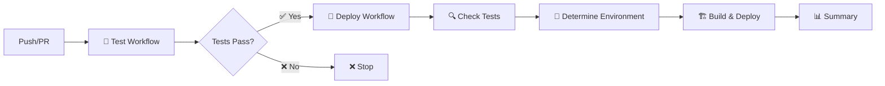
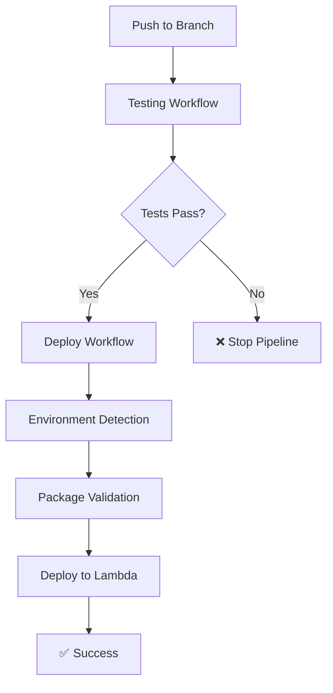

# 🚀 FBO Lambda Template

> **Template avanzado para funciones Lambda del Financial Backoffice de Yummy Inc**

[](https://github.com/yummysuperapp/fbo-lambda-billing-create/actions/workflows/test.yml)
[](https://github.com/yummysuperapp/fbo-lambda-billing-create/actions/workflows/deploy.yml)
[](https://github.com/yummysuperapp/fbo-lambda-billing-create/actions/workflows/branch-naming.yml)
[](https://nodejs.org/)
[](https://www.typescriptlang.org/)
[](https://vitest.dev/)
[](https://vitest.dev/)
[](LICENSE)

## 📋 Descripción

Template empresarial ultra-optimizado para el desarrollo de funciones AWS Lambda en el ecosistema del Financial Backoffice de Yummy Inc. Diseñado con las mejores prácticas de la industria, configuración TypeScript ultra-estricta, testing avanzado con Vitest, y pipelines de CI/CD inteligentes con quality gates automáticos.

### 🎯 Casos de Uso Principales

- **Procesamiento de Transacciones Financieras**: Validación, transformación y enrutamiento
- **Integración con APIs de Open Banking**: Conectores seguros y resilientes
- **Analytics y Reporting**: Procesamiento de datos financieros para BigQuery
- **Microservicios de Backoffice**: Operaciones administrativas y de soporte
- **Event-Driven Architecture**: Procesamiento de eventos financieros en tiempo real

## 🌐 Estándares de Idioma y Documentación

> **IMPORTANTE**: Este proyecto sigue estándares específicos de idioma para mantener consistencia y profesionalismo.

### 📝 Convenciones de Idioma

- **Documentación Principal**: Escrita en **español** (README, guías, comentarios de documentación)
- **Código Fuente**: Escrito completamente en **inglés** (variables, funciones, clases, comentarios de código)
- **Fragmentos de Código en Documentación**: Todos los ejemplos de código en **inglés**
- **Nombres de Archivos y Directorios**: En **inglés** siguiendo convenciones estándar
- **Commits y Pull Requests**: Títulos y descripciones en **español**, código en **inglés**

### 📚 Documentación Completa

La documentación técnica completa y actualizada del proyecto se encuentra disponible en:

**🔗 [Notion - Financial Backoffice Documentation](https://www.notion.so/yummy/financial-backoffice)**

Esta documentación incluye:

- Arquitectura detallada del sistema
- Guías de implementación paso a paso
- Diagramas de flujo y casos de uso
- Especificaciones técnicas completas
- Procedimientos operativos y troubleshooting
- Roadmap y planificación de features

### 🎯 Ejemplo de Aplicación

```typescript
// ✅ CORRECTO: Código en inglés
const calculateTransactionFee = (amount: number): number => {
  return amount * 0.025;
};

// ❌ INCORRECTO: Código en español
const calcularComisionTransaccion = (monto: number): number => {
  return monto * 0.025;
};
```

```markdown
<!-- ✅ CORRECTO: Documentación en español -->

## Configuración de Base de Datos

Esta sección explica cómo configurar la conexión a PostgreSQL.

<!-- ❌ INCORRECTO: Documentación en inglés -->

## Database Configuration

This section explains how to configure PostgreSQL connection.
```

## 🛠️ Stack Tecnológico

### Core Technologies

- **Node.js 22.x**: Runtime LTS con ES Modules nativos y performance optimizada
- **TypeScript 5.7+**: Configuración ultra-estricta con `strict: true` y opciones avanzadas
- **AWS Lambda**: Serverless computing con handlers optimizados para event-driven architecture
- **Vitest v2.1+**: Framework de testing moderno con cobertura del 100% y setup avanzado
- **ESLint v9**: Flat config con TypeScript ESLint v8 y reglas estrictas

### Bases de Datos y Storage

- **PostgreSQL**: Cliente nativo `pg` con pool de conexiones, transacciones y tipos seguros
- **MongoDB**: Driver oficial con conexiones optimizadas y validación de esquemas
- **BigQuery**: SDK oficial de Google Cloud para analytics y consultas complejas
- **AWS S3**: SDK v3 para almacenamiento de archivos y presigned URLs

### APIs y Servicios Externos

- **Finance API**: Integración con servicios financieros multi-ambiente
- **HTTP Client**: Axios con interceptors, retry logic y manejo robusto de errores
- **X API**: Integración con servicios de terceros autenticados
- **Logging**: Sistema de logs estructurado con niveles configurables y formato JSON
- **Validation**: Zod para validación de esquemas robusta y type-safe

### 🚀 Características Principales

#### 🏗️ Arquitectura y Desarrollo

- **TypeScript Ultra-Estricto**: Configuración avanzada con `strict: true`, `noImplicitAny`, `exactOptionalPropertyTypes`
- **ES Modules Nativos**: Soporte completo con `type: "module"` y archivos `.mjs`
- **Path Aliases Avanzados**: Sistema completo de imports con `@/*`, `@/types`, `@/clients/*`, etc.
- **Arquitectura Modular**: Separación clara en Clients, Services, Utils, Handlers e Interfaces
- **Hot Reload**: Desarrollo rápido con tsx y recarga automática

#### 🧪 Testing y Calidad

- **Vitest v2.1+**: Framework de testing moderno con configuración avanzada
- **Cobertura 100%**: Thresholds obligatorios en branches, functions, lines y statements
- **Mocks Centralizados**: Sistema organizado de mocks para AWS, Axios y bases de datos
- **Fixtures Estructuradas**: Datos de prueba organizados y reutilizables
- **Setup Avanzado**: Configuración global de tests con `globals: true`

#### 🛠️ DevOps y CI/CD

- **GitHub Actions**: Workflows inteligentes con jobs secuenciales y dependencias
- **Multi-Environment**: Despliegue automático por rama (master→prod, develop→dev, testing→test)
- **Quality Gates**: Validación automática entre jobs con fallos controlados
- **Artifacts Optimizados**: Compresión nivel 6 con exclusiones inteligentes
- **Deployment Inteligente**: Trigger con `workflow_run` solo después de tests exitosos
- **Package Validation**: Validación automática de tamaño de paquete (límite 50MB)
- **Environment Variables**: Configuración segura con validación de variables requeridas
- **Rollback Ready**: Artifacts con retención de 7 días para rollbacks rápidos

#### 📊 Observabilidad y Configuración

- **Logging Estructurado**: Sistema de logs con niveles configurables y formato JSON
- **Variables de Entorno**: Configuración flexible por ambiente con validación Zod
- **Manejo de Errores**: Excepciones personalizadas y manejo centralizado
- **Configuración Dinámica**: Adaptación automática según el ambiente de ejecución

## 📁 Estructura del Proyecto

```
fbo-lambda-template/
├── 📁 .github/
│   └── 📁 workflows/
│       ├── 🧪 test.yml           # Testing workflow con coverage y quality gates
│       └── 🚀 deploy.yml         # Deployment workflow con workflow_run trigger
├── 📁 docs/
│   ├── 📖 ARCHITECTURE.md        # Documentación de arquitectura detallada
│   ├── ⚙️ CONFIGURATION.md       # Guía completa de configuración
│   └── 🔧 IMPROVEMENTS.md        # Log de mejoras y optimizaciones
├── 📁 src/
│   ├── 📁 clients/               # Clientes para servicios externos
│   │   ├── 🗄️ mongo.client.ts    # Cliente MongoDB optimizado
│   │   ├── 🐘 postgres.client.ts # Cliente PostgreSQL con pool
│   │   ├── ☁️ s3.client.ts        # Cliente AWS S3 con SDK v3
│   │   └── 📤 index.ts           # Exportaciones de clientes
│   ├── 📁 config/
│   │   ├── 🌍 environment.config.ts # Validación de variables de entorno
│   │   ├── ⚙️ app.config.ts      # Configuración de aplicación
│   │   └── 📤 index.ts           # Exportaciones de configuración
│   ├── 📁 handlers/
│   │   ├── 🎯 main.handler.ts    # Handler principal de Lambda
│   │   └── 📤 index.ts           # Exportaciones de handlers
│   ├── 📁 interfaces/
│   │   └── 📤 index.ts           # Interfaces TypeScript
│   ├── 📁 services/
│   │   ├── 💰 finance.service.ts # Servicios financieros
│   │   └── 📤 index.ts           # Exportaciones de servicios
│   ├── 📁 types/
│   │   └── 📤 index.ts           # Definiciones de tipos y esquemas Zod
│   ├── 📁 utils/
│   │   ├── 🛠️ helpers.ts         # Funciones de utilidad
│   │   ├── 📝 logger.ts          # Sistema de logging estructurado
│   │   └── 📤 index.ts           # Exportaciones de utilidades
│   └── 🎯 index.ts               # Punto de entrada principal
├── 📁 tests/
│   ├── 📁 __mocks__/             # Mocks centralizados
│   ├── 📁 __fixtures__/          # Datos de prueba estructurados
│   ├── 🧪 helpers.test.ts       # Tests de utilidades (31 tests)
│   ├── 🧪 index.test.ts         # Tests principales (5 tests)
│   ├── 🧪 mongo.client.test.ts  # Tests MongoDB (25 tests)
│   ├── 🧪 postgres.client.test.ts # Tests PostgreSQL (9 tests)
│   └── ⚙️ setup.ts              # Configuración global de tests
├── ⚙️ vitest.config.ts           # Configuración Vitest optimizada
├── 📝 tsconfig.json             # Configuración TypeScript ultra-estricta
├── 🔧 eslint.config.js          # Configuración ESLint
├── 📦 package.json              # Dependencias y scripts
├── 🎯 index.mjs                 # Entry point para Lambda
└── 📖 README.md                 # Documentación principal
```

## 🛠️ Instalación

```bash
# Instalar dependencias
npm install

# Configurar variables de entorno
cp .env.example .env
# Editar .env con tus configuraciones

# Construir el proyecto
npm run build

# Ejecutar en modo desarrollo
npm run dev
```

## 📋 Scripts Disponibles

### 🔧 Desarrollo Local

```bash
npm run start:dev          # Ejecutar en modo desarrollo con tsx
npm run start:local        # Ejecutar con NODE_ENV=local
npm run start              # Ejecutar entry point (index.mjs)
npm run build:watch        # Build con watch mode automático
```

### 🧪 Testing y Quality Assurance

```bash
npm test                   # Ejecutar suite completa de tests
npm run test:cov           # Tests con cobertura detallada
npm run test:watch         # Tests en modo watch interactivo
npm run lint               # Linting con ESLint v9
npm run lint:fix           # Fix automático de issues de linting
npm run type-check         # Verificación estricta de tipos TS
npm run check-all          # Pipeline completo: types + lint + tests
```

### 🏗️ Build y Deployment

```bash
npm run clean              # Limpiar directorio dist/
npm run build              # Build completo con prebuild automático
npm run package            # Alias para build (preparar paquete)
npm run prepare-deploy     # Pipeline completo: check-all + build

# Deployment por ambiente (requiere configuración)
npm run deploy:dev         # Deploy a ambiente de desarrollo
npm run deploy:testing     # Deploy a ambiente de testing
npm run deploy:prod        # Deploy a ambiente de producción
npm run deploy             # Deploy genérico (requiere parámetro)
```

### 📋 Comandos de Utilidad

```bash
# Verificación completa antes de commit
npm run check-all && npm run build

# Desarrollo con hot reload
npm run start:dev

# Testing continuo durante desarrollo
npm run test:watch

# Preparación para deployment
npm run prepare-deploy
```

## ⚙️ Configuración

### 🔧 Variables de Entorno Requeridas

#### Configuración Local (.env)

```bash
# AWS Credentials
AWS_ACCESS_KEY_ID=your_access_key
AWS_SECRET_ACCESS_KEY=your_secret_key
AWS_REGION=us-east-1

# API Configuration
FINANCE_API_BASE_URL=https://api.example.com
FINANCE_API_KEY=your_api_key

# BigQuery Configuration
BIGQUERY_PROJECT_ID=your_project_id
BIGQUERY_PRIVATE_KEY=your_private_key
BIGQUERY_CLIENT_EMAIL=your_client_email

# Additional APIs
X_API_KEY=your_x_api_key
```

## ⚙️ Configuraciones Técnicas Avanzadas

### 🎯 TypeScript Ultra-Estricto

Configuración más estricta disponible con `strict: true`, `noImplicitAny`, `exactOptionalPropertyTypes`, `noUncheckedIndexedAccess` y más opciones avanzadas.

### 🛣️ Path Aliases Configurados

Sistema de imports limpio con `@/*` para todos los módulos:

```typescript
// En lugar de: import { Client } from '../../../clients/http.client'
import { Client } from '@/clients/http.client';
import type { Config } from '@/types';
import { validateSchema } from '@/interfaces/validation';
```

### 📦 ES Modules Nativos

Configuración completa: `package.json` con `"type": "module"`, entry point `index.mjs` para Lambda, TypeScript con `"module": "ESNext"` e imports/exports nativos sin transpilación CommonJS.

## 🔄 Flujos de Trabajo

### 1. Subida a SFTP Bancario (S3 → SFTP)

Triggered por eventos S3:

1. Detecta nuevos archivos en S3 con el prefijo configurado
2. Valida el formato y tamaño del archivo
3. Transfiere el archivo al SFTP bancario
4. Notifica al sistema de finanzas
5. Envía notificaciones de estado

### 2. Descarga desde SFTP Bancario (SFTP → S3)

Triggered por eventos personalizados:

1. Lista archivos disponibles en SFTP bancario
2. Descarga archivos nuevos o específicos
3. Sube archivos a S3 con el prefijo de respuesta
4. Notifica al sistema de finanzas
5. Envía notificaciones de estado

## 🧪 Testing

El proyecto utiliza **Vitest 2.1+** como framework de testing con una configuración optimizada para performance y **100% de cobertura obligatorio**.

### Comandos de Testing

```bash
npm test                   # Ejecutar suite completa de tests
npm run test:cov           # Tests con cobertura detallada
npm run test:watch         # Tests en modo watch interactivo
npm run check-all          # Pipeline completo: types + lint + tests
```

### Suite de Tests Actual

- ✅ **70 tests** ejecutándose exitosamente en 4 archivos
- ✅ **100% de cobertura** obligatorio en branches, functions, lines y statements
- ✅ **Mocks centralizados** para AWS, Axios y bases de datos
- ✅ **Fixtures organizadas** para datos de prueba reutilizables
- ✅ **Path aliases** completos en tests (`@/*`)
- ✅ **Reportes optimizados**: Solo `json` y `lcov` para performance

### Estructura de Tests

```
tests/
├── __fixtures__/           # Datos de prueba reutilizables
├── __mocks__/              # Mocks para servicios externos
├── helpers.test.ts         # Tests de utilidades (31 tests)
├── index.test.ts           # Tests principales (5 tests)
├── mongo.client.test.ts    # Tests MongoDB (25 tests)
├── postgres.client.test.ts # Tests PostgreSQL (9 tests)
└── setup.ts                # Configuración global de tests
```

## 📦 Deployment

### Arquitectura de CI/CD

El sistema de CI/CD está diseñado con una arquitectura de **workflow secuencial** que garantiza la calidad antes del deployment:



**Flujo de ejecución:**

1. **Test Workflow** → Ejecuta tests, linting y quality gates
2. **Deploy Workflow** → Se activa automáticamente solo si el test workflow es exitoso
3. **Environment Detection** → Determina el ambiente basado en la rama
4. **Build & Deploy** → Construye y despliega a Lambda
5. **Summary** → Genera reporte detallado del deployment

### CI/CD Pipeline

El proyecto incluye un pipeline completo de CI/CD con **GitHub Actions** dividido en dos workflows especializados que se ejecutan secuencialmente:

### 📁 Workflows de CI/CD

#### 🧪 Test & Quality Assurance (`.github/workflows/test.yml`)

- ✅ **Tests automáticos** con Vitest (276 tests, 99.9% cobertura)
- ✅ **Linting** con ESLint v9 y **Type checking** con TypeScript
- ✅ **Comentarios automáticos** de cobertura en PRs con actualización inteligente
- ✅ **Quality Gates** con validación de resultados entre jobs
- ✅ **Artifacts de cobertura** con retención de 30 días
- ✅ **Resumen ejecutivo** en GitHub Step Summary
- 🔄 **Triggers**: Push a `master`/`develop`, PRs, y releases
- 🎯 **Jobs**: `test` (ejecución) → `quality-gate` (validación)

#### 🚀 Build & Deploy (`.github/workflows/deploy.yml`)

- ✅ **Trigger inteligente** via `workflow_run` (solo si tests pasan)
- ✅ **Validación de entorno** automática por rama (`master`→prod, `develop`→dev, `testing`→test)
- ✅ **Build optimizado** con exclusión automática de archivos innecesarios
- ✅ **Deploy automático** a Lambda con configuración dinámica de variables
- ✅ **Validación de tamaño** del paquete (límite 50MB)
- ✅ **Artifacts de construcción** con retención de 10 días y compresión nivel 6
- ✅ **Resumen ejecutivo** detallado con información de release
- 🔄 **Triggers**: `workflow_run` completion de Test workflow
- 🎯 **Jobs**: `check-tests` → `build` → `deployment-summary`

### Preparación del Paquete

El pipeline automatiza completamente la preparación del paquete Lambda:

1. **Build del proyecto**: `npm run build` (TypeScript → JavaScript)
2. **Limpieza**: Eliminación de `node_modules` de desarrollo
3. **Dependencias de producción**: `npm ci --production --silent`
4. **Creación del ZIP**: Incluye `dist/`, `node_modules/`, `package.json`
5. **Exclusiones automáticas**:
   - Tests (`*.test.js`, `*.spec.js`)
   - Archivos de desarrollo (`.env*`, `tsconfig.json`)
   - Documentación (`README.md`, `docs/`)
   - Configuración de herramientas (`.eslint*`, `.prettier*`)
6. **Validación de tamaño**: Verificación automática del límite de 50MB
7. **Compresión optimizada**: Nivel 6 para balance tamaño/velocidad

### 🌍 Mapeo de Ramas a Ambientes

| Rama      | Ambiente           | Descripción               | Variables |
| --------- | ------------------ | ------------------------- | --------- |
| `master`  | **Production** 🏭  | Ambiente de producción    | `*_PROD`  |
| `develop` | **Development** 🧪 | Ambiente de desarrollo    | `*_DEV`   |
| `testing` | **Testing** 🔬     | Ambiente de testing       | `*_DEV`   |
| Otras     | **None** ❌        | Sin deployment automático | N/A       |

### 🌿 Convenciones de Nomenclatura de Ramas

Todas las ramas de desarrollo deben seguir la convención que incluye el código de Jira como prefijo:

#### Formato Obligatorio

```
<tipo>/FB-<número>_<descripción-corta>
```

#### Tipos de Rama Permitidos

- **`feat/`** - Nuevas funcionalidades
- **`fix/`** - Corrección de bugs
- **`hotfix/`** - Correcciones urgentes en producción
- **`refactor/`** - Refactoring de código
- **`docs/`** - Cambios en documentación
- **`test/`** - Añadir o modificar tests
- **`chore/`** - Tareas de mantenimiento

#### Ejemplos Válidos

```bash
feat/FB-123_integracion-bigquery
fix/FB-456_error-conexion-mongodb
hotfix/FB-789_fallo-critico-produccion
refactor/FB-234_optimizacion-queries
docs/FB-567_actualizacion-readme
test/FB-890_cobertura-servicios
chore/FB-101_actualizacion-dependencias
```

#### Validación Automática

- ✅ **Workflow de validación** automática en PRs
- ✅ **Comentarios automáticos** con instrucciones de corrección
- ✅ **Bloqueo de merge** hasta cumplir la convención
- ✅ **Guía detallada** en [CONTRIBUTING.md](CONTRIBUTING.md#convenciones-de-nomenclatura-de-ramas)

### 🔄 Flujo de Deployment por Rama

```bash
# Desarrollo
git push origin develop
# → Ejecuta tests → Deploy a Development Lambda

# Testing
git push origin testing
# → Ejecuta tests → Deploy a Testing Lambda

# Producción
git push origin master
# → Ejecuta tests → Deploy a Production Lambda
```

### Comandos Manuales (Desarrollo Local)

```bash
# Build del proyecto
npm run build

# Instalación de dependencias de producción
npm ci --production

# Creación manual del ZIP
zip -r lambda-package.zip dist/ node_modules/ package.json

# Exclusiones automáticas en CI/CD
# Tests, archivos de desarrollo, documentación
```

```bash
# Crear paquete optimizado para Lambda
npm run package

# Deploy manual a desarrollo
npm run deploy:dev

# Deploy manual a producción
npm run deploy:prod

# Verificación completa antes del deployment
npm run check-all
npm run prepare-deploy

# Scripts de testing optimizados
npm test              # Tests sin watch
npm run test:cov      # Tests con coverage (json + lcov)
npm run test:watch    # Tests en modo watch para desarrollo
```

### Workflow Dependencies



### Configuración de Lambda

#### Configuración Base

- **Runtime**: Node.js 22.x
- **Handler**: `dist/index.handler`
- **Memory**: 512 MB (recomendado)
- **Timeout**: 5 minutos
- **Architecture**: x86_64

#### Deployment Automático

- **Método**: `aws lambda update-function-code` via GitHub Actions
- **Trigger**: Automático después de tests exitosos
- **Validación**: Verificación de entorno y tamaño del paquete
- **Rollback**: Manual via AWS Console si es necesario

#### Variables de Entorno por Ambiente

Configuradas automáticamente por el pipeline según el ambiente:

```bash
# Configuración dinámica por ambiente
FINANCE_API_BASE_URL    # DEV/PROD según rama
FINANCE_API_KEY         # DEV/PROD según rama
BIGQUERY_PROJECT_ID     # Compartido
BIGQUERY_PRIVATE_KEY    # Compartido
BIGQUERY_CLIENT_EMAIL   # Compartido
X_API_KEY               # Compartido
```

#### Optimizaciones

- **Bundle Size**: Validación automática (límite 50MB)
- **Exclusiones**: Archivos de desarrollo y tests automáticamente excluidos
- **Compresión**: Nivel 6 para balance óptimo tamaño/velocidad
- **Artifacts**: Retención de 10 días para debugging

### Secrets Requeridos para CI/CD

```bash
# AWS Credentials
AWS_ACCESS_KEY_ID
AWS_SECRET_ACCESS_KEY
AWS_REGION

# Lambda Function (configurada por environment)
LAMBDA_FUNCTION_NAME

# Environment Variables por ambiente
FINANCE_API_BASE_URL_DEV/PROD
FINANCE_API_KEY_DEV/PROD
BIGQUERY_PROJECT_ID
BIGQUERY_PRIVATE_KEY
BIGQUERY_CLIENT_EMAIL
X_API_KEY
```

## 🔄 Mejoras Recientes Implementadas

### ✅ Optimización de CI/CD

- **Workflow Dependencies**: `deploy.yml` usa `workflow_run` para ejecutarse solo tras testing exitoso
- **Quality Gates**: Eliminación de ejecución paralela no deseada entre testing y deployment
- **Package Validation**: Validación automática de tamaño de paquete Lambda (límite 50MB)
- **Environment Variables**: Validación robusta de variables requeridas antes del deployment

### ✅ Optimización de Testing y Código

- **Reportes Optimizados**: Configuración Vitest para generar solo `json` y `lcov`
- **Performance**: Reducción significativa en tiempo de ejecución de tests
- **Test Suite**: 70 tests organizados en 4 archivos con 100% de cobertura
- **Dependencies**: Optimización de dependencias y eliminación de código no utilizado
- **Type Safety**: Configuración TypeScript ultra-estricta mantenida

## 📋 GitHub Templates y Proceso

### Plantillas de Desarrollo

Este template incluye plantillas completas para GitHub que implementan nuestros dogmas del equipo:

- [📋 Pull Request Template](.github/pull_request_template.md) - Validación completa de DoD
- [🐛 Bug Report Template](.github/ISSUE_TEMPLATE/bug_report.md) - Reporte estructurado de bugs
- [✨ Feature Request Template](.github/ISSUE_TEMPLATE/feature_request.md) - Basado en Definition of Ready
- [🔧 Technical Task Template](.github/ISSUE_TEMPLATE/technical_task.md) - Para spikes, POCs y mejoras técnicas
- [📊 Technical Debt Template](.github/ISSUE_TEMPLATE/technical_debt.md) - Documentación de deuda técnica

### Dogmas del Equipo Implementados

- ✅ **Escalabilidad**: Todo debe ser escalable, elástico y pensado en usos futuros
- ✅ **Testing**: Incremento mínimo de 3% en cobertura (excepción: >80%)
- ✅ **Responsabilidad**: Toda tarea asignada a responsable específico
- ✅ **Calidad**: Solo PM/TL pueden marcar tareas como HECHO
- ✅ **Documentación**: Todo bug sin documentación es un error
- ✅ **Deuda Técnica**: Bugs documentados y despriorizados son deuda técnica válida

### Definition of Ready (DoR) y Definition of Done (DoD)

Todas las plantillas incorporan validación automática de:

- 🎯 Claridad de objetivos y criterios de aceptación
- 🔍 Identificación de dependencias y viabilidad técnica
- 📊 Métricas de éxito y timeline establecidos
- 🧪 Testing completo con evidencia documentada
- 📚 Documentación técnica y funcional actualizada

## 🔒 Políticas y Gobernanza

### 📜 Licencia y Uso

- **Licencia Privada** de Yummy Inc. con términos específicos
- **Restricciones de uso** claramente definidas
- **Contacto legal** para consultas de licencia
- **Términos de terminación** y jurisdicción

### 🛡️ Seguridad

- **Política de reporte** de vulnerabilidades con proceso estructurado
- **Clasificación de severidad** (Critical, High, Medium, Low)
- **Timeframes de respuesta** definidos (24h confirmación, 72h evaluación)
- **Estándares de seguridad** para autenticación, validación y manejo de secretos
- **Monitoreo y detección** de eventos de seguridad
- **Plan de respuesta** a incidentes con contactos de emergencia

### 🤝 Código de Conducta

- **Estándares de comportamiento** profesional
- **Proceso de reporte** y investigación
- **Consecuencias por incumplimiento** claramente definidas
- **Integración con dogmas del equipo** (responsabilidad, calidad, transparencia)
- **Mejora continua** y reconocimiento

### 🚀 Guía de Contribución

- **Proceso completo** de desarrollo y contribución
- **Estándares de código** y naming conventions
- **Flujo de trabajo** con Git y GitHub
- **Criterios de revisión** de código
- **Políticas de testing** y cobertura

### 🔄 Gestión de Dependencias

- **Renovate Bot** configurado para actualizaciones automáticas
- **Agrupación inteligente** de dependencias relacionadas
- **Auto-merge** para patches y minor updates
- **Revisión manual** requerida para major updates
- **Alertas de seguridad** procesadas inmediatamente
- **Programación semanal** (lunes antes de 6 AM COT)

### 📝 Documentación de Cambios

- **Changelog** estructurado siguiendo Keep a Changelog
- **Semantic Versioning** implementado
- **Proceso de release** documentado
- **Historial completo** de mejoras y cambios

## 📚 Documentación Adicional

### 📋 Plantillas y Procesos

- [📋 Plantillas de GitHub](.github/README.md) - Guía completa de plantillas para PRs e Issues
- [🚀 Guía de Contribución](CONTRIBUTING.md) - Proceso completo de desarrollo y contribución
- [🤝 Código de Conducta](CODE_OF_CONDUCT.md) - Estándares de comportamiento del equipo

### 🔒 Políticas y Seguridad

- [🛡️ Política de Seguridad](SECURITY.md) - Reporte de vulnerabilidades y estándares
- [📜 Licencia](LICENSE) - Términos de uso y restricciones
- [📝 Changelog](CHANGELOG.md) - Historial de cambios y versiones

### 🏗️ Documentación Técnica

- [🏗️ Arquitectura del Sistema](docs/ARCHITECTURE.md) - Diseño y patrones arquitectónicos
- [⚙️ Guía de Configuración](docs/CONFIGURATION.md) - Configuración completa por ambiente
- [📈 Log de Mejoras](docs/IMPROVEMENTS.md) - Historial detallado de optimizaciones

### 🧪 Testing y CI/CD

- [🧪 Suite de Testing](tests/) - 70 tests con cobertura del 100%
- [🚀 Workflows CI/CD](.github/workflows/) - Pipelines optimizados con quality gates
- [📋 GitHub Templates](.github/) - Plantillas de PR e Issues con dogmas del equipo

### 🔧 Configuración del Proyecto

- [🔄 Renovate Config](renovate.json) - Configuración de actualizaciones automáticas
- [📝 Editor Config](.editorconfig) - Configuración de formato de código
- [🟢 Node Version](.nvmrc) - Versión de Node.js recomendada
- [🚫 Git Ignore](.gitignore) - Archivos excluidos del control de versiones

### 💬 Comunicación

- [💬 Discusiones del Equipo](https://github.com/yummysuperapp/fbo-lambda-template/discussions) - Espacio para ideas y feedback
- [📧 Contacto de Seguridad](mailto:security@yummysuperapp.com) - Reporte de vulnerabilidades
- [👨‍💻 Tech Lead](mailto:jose.carrillo@yummysuperapp.com) - José Carrillo

## 🔒 Seguridad

- ✅ **Validación estricta** de entrada con Zod
- ✅ **Sanitización** de nombres de archivo
- ✅ **Manejo seguro** de credenciales
- ✅ **Logging estructurado** sin exposición de datos sensibles
- ✅ **Timeouts y límites** de reintentos configurables
- ✅ **Validación de tipos** en tiempo de ejecución
- ✅ **Tipado estricto** sin uso de `any`
- ✅ **Secrets management** en CI/CD
