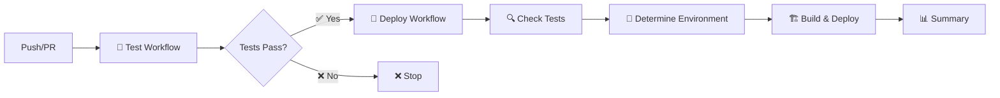
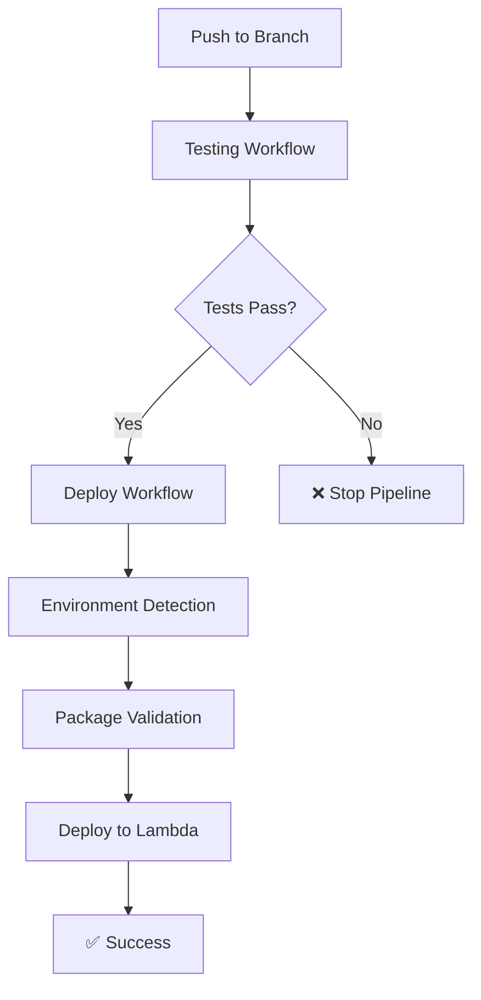

# 🚀 FBO Lambda Template

> **Template avanzado para funciones Lambda del Financial Backoffice de Yummy Inc**

[](https://nodejs.org/)
[](https://www.typescriptlang.org/)
[](https://aws.amazon.com/lambda/)
[](LICENSE)
[](https://vitest.dev/)
[](https://vitest.dev/)
[](https://github.com/features/actions)
[](https://github.com/features/actions)

## 📋 Descripción

Template empresarial ultra-optimizado para el desarrollo de funciones AWS Lambda en el ecosistema del Financial Backoffice de Yummy Inc. Diseñado con las mejores prácticas de la industria, configuración TypeScript ultra-estricta, testing avanzado con Vitest, y pipelines de CI/CD inteligentes con quality gates automáticos.

### 🎯 Casos de Uso Principales
- **Procesamiento de Transacciones Financieras**: Validación, transformación y enrutamiento
- **Integración con APIs de Open Banking**: Conectores seguros y resilientes
- **Analytics y Reporting**: Procesamiento de datos financieros para BigQuery
- **Microservicios de Backoffice**: Operaciones administrativas y de soporte
- **Event-Driven Architecture**: Procesamiento de eventos financieros en tiempo real

## 🛠️ Stack Tecnológico

### Core Technologies
- **Node.js 22.x**: Runtime LTS con performance optimizada
- **TypeScript 5.7+**: Tipado ultra-estricto con configuración avanzada
- **AWS Lambda**: Serverless computing con arquitectura event-driven
- **ES Modules**: Configuración nativa con `type: "module"` y archivos `.mjs`

### Bases de Datos y Storage
- **PostgreSQL**: Cliente `pg` con pool de conexiones y transacciones
- **MongoDB**: Driver oficial con conexiones optimizadas
- **BigQuery**: SDK de Google Cloud para analytics avanzados
- **AWS S3**: SDK v3 para almacenamiento de archivos y presigned URLs

### APIs y Servicios Externos
- **Finance API**: Integración con servicios financieros multi-ambiente
- **HTTP Client**: Axios con interceptors, retry logic y manejo de errores
- **X API**: Integración con servicios de terceros autenticados
- **Logging**: Sistema de logs estructurado con niveles configurables
- **Validation**: Zod para validación de esquemas robusta y type-safe

## 🚀 Tecnologías y Características

### Stack Tecnológico Principal
- **Runtime**: Node.js 22.x con ES Modules nativos
- **Lenguaje**: TypeScript 5.7+ con configuración ultra-estricta
- **Framework**: AWS Lambda con handlers optimizados para serverless
- **Testing**: Vitest v2.1+ con cobertura del 100% y setup avanzado
- **Linting**: ESLint v9 con flat config y TypeScript ESLint v8
- **Build**: Compilación TypeScript con output optimizado para Lambda

### Bases de Datos y Storage
- **PostgreSQL**: Cliente nativo `pg` con pool de conexiones y tipos seguros
- **MongoDB**: Driver oficial con conexiones optimizadas y validación
- **BigQuery**: SDK oficial de Google Cloud para analytics
- **AWS S3**: SDK v3 para almacenamiento de archivos y presigned URLs

### APIs y Servicios Externos
- **Finance API**: Integración con servicios financieros multi-ambiente
- **HTTP Client**: Axios con interceptors, retry logic y manejo de errores
- **X API**: Integración con servicios de terceros autenticados
- **Logging**: Sistema de logs estructurado con niveles configurables
- **Validation**: Zod para validación de esquemas robusta y type-safe

### Características de Desarrollo Avanzadas
- ✅ **TypeScript Ultra-Estricto**: Configuración completa con `strict: true` y opciones avanzadas
- ✅ **Path Aliases Completos**: Sistema de imports limpio con `@/*` para todos los módulos
- ✅ **Hot Reload Inteligente**: tsx para desarrollo rápido con recarga automática
- ✅ **ES Modules Nativos**: Configuración completa con `type: "module"` y `.mjs`
- ✅ **Coverage Thresholds**: 100% obligatorio en branches, functions, lines y statements
- ✅ **Quality Gates**: Validación automática entre jobs de CI/CD con fallos controlados
- ✅ **Multi-Environment**: Configuración dinámica por rama (master/develop/testing)
- ✅ **Deployment Inteligente**: Trigger automático solo después de tests exitosos con `workflow_run`
- ✅ **Artifacts Optimizados**: Compresión nivel 6, exclusiones inteligentes y retención configurada
- ✅ **Documentation as Code**: Documentación técnica completa en `/docs` con arquitectura detallada
- ✅ **Testing Optimizado**: Configuración Vitest con reportes `json` y `lcov` únicamente
- ✅ **CI/CD Robusto**: Workflows secuenciales con validación de dependencias y quality gates

## 🚀 Características Principales

### 🏗️ Arquitectura y Desarrollo
- **TypeScript Ultra-Estricto**: Configuración avanzada con `strict: true`, `noImplicitAny`, `exactOptionalPropertyTypes`
- **ES Modules Nativos**: Soporte completo con `type: "module"` y archivos `.mjs`
- **Path Aliases Avanzados**: Sistema completo de imports con `@/*`, `@/types`, `@/clients/*`, etc.
- **Arquitectura Modular**: Separación clara en Clients, Services, Utils, Handlers e Interfaces
- **Hot Reload**: Desarrollo rápido con tsx y recarga automática

### 🧪 Testing y Calidad
- **Vitest v2.1+**: Framework de testing moderno con configuración avanzada
- **Cobertura 100%**: Thresholds obligatorios en branches, functions, lines y statements
- **Mocks Centralizados**: Sistema organizado de mocks para AWS, Axios y bases de datos
- **Fixtures Estructuradas**: Datos de prueba organizados y reutilizables
- **Setup Avanzado**: Configuración global de tests con `globals: true`

### 🔌 Integraciones y Clientes
- **PostgreSQL**: Cliente `pg` con pool de conexiones y manejo de transacciones
- **MongoDB**: Driver oficial con conexiones optimizadas y validación de esquemas
- **BigQuery**: SDK de Google Cloud para analytics y consultas complejas
- **AWS S3**: SDK v3 con operaciones completas y presigned URLs
- **HTTP Client**: Axios con interceptors, retry logic y manejo robusto de errores

### 🛠️ DevOps y CI/CD
- **GitHub Actions**: Workflows inteligentes con jobs secuenciales y dependencias
- **Multi-Environment**: Despliegue automático por rama (master→prod, develop→dev, testing→test)
- **Quality Gates**: Validación automática entre jobs con fallos controlados
- **Artifacts Optimizados**: Compresión nivel 6 con exclusiones inteligentes
- **Deployment Inteligente**: Trigger con `workflow_run` solo después de tests exitosos
- **Package Validation**: Validación automática de tamaño de paquete (límite 50MB)
- **Environment Variables**: Configuración segura con validación de variables requeridas
- **Rollback Ready**: Artifacts con retención de 7 días para rollbacks rápidos

### 📊 Observabilidad y Configuración
- **Logging Estructurado**: Sistema de logs con niveles configurables y formato JSON
- **Variables de Entorno**: Configuración flexible por ambiente con validación Zod
- **Manejo de Errores**: Excepciones personalizadas y manejo centralizado
- **Configuración Dinámica**: Adaptación automática según el ambiente de ejecución

## 📁 Estructura del Proyecto

```
fbo-lambda-template/
├── 📁 .github/
│   └── 📁 workflows/
│       ├── 🧪 test.yml           # Testing workflow con coverage y quality gates
│       └── 🚀 deploy.yml         # Deployment workflow con workflow_run trigger
├── 📁 docs/
│   ├── 📖 ARCHITECTURE.md        # Documentación de arquitectura detallada
│   ├── ⚙️ CONFIGURATION.md       # Guía completa de configuración
│   └── 🔧 IMPROVEMENTS.md        # Log de mejoras y optimizaciones
├── 📁 src/
│   ├── 📁 clients/               # Clientes para servicios externos
│   │   ├── 🗄️ mongo.client.ts    # Cliente MongoDB optimizado
│   │   ├── 🐘 postgres.client.ts # Cliente PostgreSQL con pool
│   │   ├── ☁️ s3.client.ts        # Cliente AWS S3 con SDK v3
│   │   └── 📤 index.ts           # Exportaciones de clientes
│   ├── 📁 config/
│   │   ├── 🌍 environment.config.ts # Validación de variables de entorno
│   │   ├── ⚙️ app.config.ts      # Configuración de aplicación
│   │   └── 📤 index.ts           # Exportaciones de configuración
│   ├── 📁 handlers/
│   │   ├── 🎯 main.handler.ts    # Handler principal de Lambda
│   │   └── 📤 index.ts           # Exportaciones de handlers
│   ├── 📁 interfaces/
│   │   └── 📤 index.ts           # Interfaces TypeScript
│   ├── 📁 services/
│   │   ├── 💰 finance.service.ts # Servicios financieros
│   │   └── 📤 index.ts           # Exportaciones de servicios
│   ├── 📁 types/
│   │   └── 📤 index.ts           # Definiciones de tipos y esquemas Zod
│   ├── 📁 utils/
│   │   ├── 🛠️ helpers.ts         # Funciones de utilidad
│   │   ├── 📝 logger.ts          # Sistema de logging estructurado
│   │   └── 📤 index.ts           # Exportaciones de utilidades
│   └── 🎯 index.ts               # Punto de entrada principal
├── 📁 tests/
│   ├── 📁 __mocks__/             # Mocks centralizados
│   ├── 📁 __fixtures__/          # Datos de prueba estructurados
│   ├── 🧪 helpers.test.ts       # Tests de utilidades (31 tests)
│   ├── 🧪 index.test.ts         # Tests principales (5 tests)
│   ├── 🧪 mongo.client.test.ts  # Tests MongoDB (25 tests)
│   ├── 🧪 postgres.client.test.ts # Tests PostgreSQL (9 tests)
│   └── ⚙️ setup.ts              # Configuración global de tests
├── ⚙️ vitest.config.ts           # Configuración Vitest optimizada
├── 📝 tsconfig.json             # Configuración TypeScript ultra-estricta
├── 🔧 eslint.config.js          # Configuración ESLint
├── 📦 package.json              # Dependencias y scripts
├── 🎯 index.mjs                 # Entry point para Lambda
└── 📖 README.md                 # Documentación principal
```

## 🛠️ Instalación

```bash
# Instalar dependencias
npm install

# Configurar variables de entorno
cp .env.example .env
# Editar .env con tus configuraciones

# Construir el proyecto
npm run build

# Ejecutar en modo desarrollo
npm run dev
```

## 📋 Scripts Disponibles

### 🔧 Desarrollo Local
```bash
npm run start:dev          # Ejecutar en modo desarrollo con tsx
npm run start:local        # Ejecutar con NODE_ENV=local
npm run start              # Ejecutar entry point (index.mjs)
npm run build:watch        # Build con watch mode automático
```

### 🧪 Testing y Quality Assurance
```bash
npm test                   # Ejecutar suite completa de tests
npm run test:cov           # Tests con cobertura detallada
npm run test:watch         # Tests en modo watch interactivo
npm run lint               # Linting con ESLint v9
npm run lint:fix           # Fix automático de issues de linting
npm run type-check         # Verificación estricta de tipos TS
npm run check-all          # Pipeline completo: types + lint + tests
```

### 🏗️ Build y Deployment
```bash
npm run clean              # Limpiar directorio dist/
npm run build              # Build completo con prebuild automático
npm run package            # Alias para build (preparar paquete)
npm run prepare-deploy     # Pipeline completo: check-all + build

# Deployment por ambiente (requiere configuración)
npm run deploy:dev         # Deploy a ambiente de desarrollo
npm run deploy:testing     # Deploy a ambiente de testing
npm run deploy:prod        # Deploy a ambiente de producción
npm run deploy             # Deploy genérico (requiere parámetro)
```

### 📋 Comandos de Utilidad
```bash
# Verificación completa antes de commit
npm run check-all && npm run build

# Desarrollo con hot reload
npm run start:dev

# Testing continuo durante desarrollo
npm run test:watch

# Preparación para deployment
npm run prepare-deploy
```

## ⚙️ Configuración

### 🔧 Variables de Entorno Requeridas

#### Configuración Local (.env)
```bash
# AWS Credentials
AWS_ACCESS_KEY_ID=your_access_key
AWS_SECRET_ACCESS_KEY=your_secret_key
AWS_REGION=us-east-1

# API Configuration
FINANCE_API_BASE_URL=https://api.example.com
FINANCE_API_KEY=your_api_key

# BigQuery Configuration
BIGQUERY_PROJECT_ID=your_project_id
BIGQUERY_PRIVATE_KEY=your_private_key
BIGQUERY_CLIENT_EMAIL=your_client_email

# Additional APIs
X_API_KEY=your_x_api_key
```

## ⚙️ Configuraciones Técnicas Avanzadas

### 🎯 TypeScript Ultra-Estricto
El proyecto utiliza la configuración más estricta de TypeScript disponible:

```json
{
  "compilerOptions": {
    "strict": true,
    "noImplicitAny": true,
    "noImplicitReturns": true,
    "noImplicitThis": true,
    "noUnusedLocals": true,
    "noUnusedParameters": true,
    "exactOptionalPropertyTypes": true,
    "noUncheckedIndexedAccess": true,
    "noImplicitOverride": true,
    "allowUnusedLabels": false,
    "allowUnreachableCode": false
  }
}
```

### 🛣️ Path Aliases Configurados
Imports limpios y organizados:

```typescript
// En lugar de: import { Client } from '../../../clients/http.client'
import { Client } from '@/clients/http.client';
import type { Config } from '@/types';
import { validateSchema } from '@/interfaces/validation';
```

### 🧪 Testing con Cobertura 100%
Configuración de Vitest con thresholds estrictos:

```typescript
// vitest.config.ts
export default defineConfig({
  test: {
    coverage: {
      thresholds: {
        global: {
          branches: 100,
          functions: 100,
          lines: 100,
          statements: 100
        }
      }
    }
  }
});
```

### 📦 ES Modules Nativos
Configuración completa para ES Modules:

- `package.json`: `"type": "module"`
- Entry point: `index.mjs` para Lambda
- TypeScript: `"module": "ESNext"`
- Imports/exports nativos sin transpilación CommonJS

## 🔄 Flujos de Trabajo

### 1. Subida a SFTP Bancario (S3 → SFTP)

Triggered por eventos S3:
1. Detecta nuevos archivos en S3 con el prefijo configurado
2. Valida el formato y tamaño del archivo
3. Transfiere el archivo al SFTP bancario
4. Notifica al sistema de finanzas
5. Envía notificaciones de estado

### 2. Descarga desde SFTP Bancario (SFTP → S3)

Triggered por eventos personalizados:
1. Lista archivos disponibles en SFTP bancario
2. Descarga archivos nuevos o específicos
3. Sube archivos a S3 con el prefijo de respuesta
4. Notifica al sistema de finanzas
5. Envía notificaciones de estado

## 🧪 Testing

El proyecto utiliza **Vitest 2.1+** como framework de testing con una configuración optimizada para performance.

### Comandos de Testing

```bash
# Ejecutar todos los tests
npm run test

# Tests con cobertura (genera reportes JSON y LCOV)
npm run test:cov

# Tests en modo watch para desarrollo
npm run test:watch

# Verificar tipos, lint y tests
npm run check-all
```

### Suite de Tests Actual

- ✅ **70 tests** ejecutándose exitosamente en 4 archivos
- ✅ **100% de cobertura** obligatorio en todas las métricas
- ✅ **helpers.test.ts**: 31 tests para funciones de utilidad
- ✅ **mongo.client.test.ts**: 25 tests para MongoDB client
- ✅ **postgres.client.test.ts**: 9 tests para PostgreSQL client
- ✅ **index.test.ts**: 5 tests principales
- ✅ **Mocks centralizados** para servicios externos
- ✅ **Fixtures organizadas** para datos de prueba
- ✅ **Path aliases** completos en tests (`@/*`)
- ✅ **Reportes optimizados**: Solo `json` y `lcov` para performance

### Configuración Vitest Optimizada

```typescript
coverage: {
  provider: 'v8',
  reporter: ['json', 'lcov'], // Solo reportes esenciales
  thresholds: {
    global: {
      branches: 100,
      functions: 100,
      lines: 100,
      statements: 100
    }
  }
}
```

### Estructura de Tests

```
tests/
├── __fixtures__/     # Datos de prueba reutilizables
├── __mocks__/        # Mocks para servicios externos
├── helpers.test.ts   # Tests de utilidades (31 tests)
├── index.test.ts     # Tests principales (5 tests)
├── mongo.client.test.ts # Tests MongoDB (25 tests)
├── postgres.client.test.ts # Tests PostgreSQL (9 tests)
└── setup.ts          # Configuración global de tests
```

## 📦 Deployment

### Arquitectura de CI/CD

El sistema de CI/CD está diseñado con una arquitectura de **workflow secuencial** que garantiza la calidad antes del deployment:



**Flujo de ejecución:**
1. **Test Workflow** → Ejecuta tests, linting y quality gates
2. **Deploy Workflow** → Se activa automáticamente solo si el test workflow es exitoso
3. **Environment Detection** → Determina el ambiente basado en la rama
4. **Build & Deploy** → Construye y despliega a Lambda
5. **Summary** → Genera reporte detallado del deployment

### CI/CD Pipeline

El proyecto incluye un pipeline completo de CI/CD con **GitHub Actions** dividido en dos workflows especializados que se ejecutan secuencialmente:

### 📁 Estado Actual de los Workflows

#### `.github/workflows/test.yml` - Test & Quality Assurance
- **Versión**: Actualizada con quality gates y reportes automáticos
- **Jobs**: `test` → `quality-gate`
- **Características**:
  - Generación automática de reportes de cobertura en Markdown
  - Comentarios inteligentes en PRs con actualización automática
  - Quality gates que validan resultados entre jobs
  - Artifacts con retención de 30 días
  - Resumen ejecutivo en GitHub Step Summary

#### `.github/workflows/deploy.yml` - Build & Deploy
- **Versión**: Actualizada con trigger inteligente y configuración dinámica
- **Jobs**: `check-tests` → `build` → `deployment-summary`
- **Características**:
  - Trigger via `workflow_run` (solo ejecuta si tests pasan)
  - Determinación automática de ambiente por rama
  - Configuración dinámica de variables de entorno
  - Validación de tamaño de paquete (50MB)
  - Artifacts con compresión nivel 6 y retención de 10 días
  - Resumen detallado de deployment con información de release

#### 🧪 Test & Quality Assurance (`.github/workflows/test.yml`)
- ✅ **Tests automáticos** con Vitest (276 tests, 99.9% cobertura)
- ✅ **Linting** con ESLint v9 y **Type checking** con TypeScript
- ✅ **Comentarios automáticos** de cobertura en PRs con actualización inteligente
- ✅ **Quality Gates** con validación de resultados entre jobs
- ✅ **Reportes detallados** en formato HTML, LCOV y Markdown
- ✅ **Artifacts de cobertura** con retención de 30 días
- ✅ **Resumen ejecutivo** en GitHub Step Summary
- 🔄 **Triggers**: Push a `master`/`develop`, PRs, y releases
- 🎯 **Jobs**: `test` (ejecución) → `quality-gate` (validación)

#### 🚀 Deploy (`.github/workflows/deploy.yml`)
- ✅ **Trigger inteligente** via `workflow_run` (solo si tests pasan)
- ✅ **Validación de entorno** automática por rama (`master`→prod, `develop`→dev, `testing`→test)
- ✅ **Build optimizado** con exclusión automática de archivos innecesarios
- ✅ **Deploy automático** a Lambda con configuración dinámica de variables
- ✅ **Validación de tamaño** del paquete (límite 50MB)
- ✅ **Artifacts de construcción** con retención de 10 días y compresión nivel 6
- ✅ **Resumen ejecutivo** detallado con información de release
- ✅ **Configuración de entorno** automática por ambiente
- 🔄 **Triggers**: `workflow_run` completion de Test workflow
- 🎯 **Jobs**: `check-tests` → `build` → `deployment-summary`

### Preparación del Paquete

El pipeline automatiza completamente la preparación del paquete Lambda:

1. **Build del proyecto**: `npm run build` (TypeScript → JavaScript)
2. **Limpieza**: Eliminación de `node_modules` de desarrollo
3. **Dependencias de producción**: `npm ci --production --silent`
4. **Creación del ZIP**: Incluye `dist/`, `node_modules/`, `package.json`
5. **Exclusiones automáticas**: 
   - Tests (`*.test.js`, `*.spec.js`)
   - Archivos de desarrollo (`.env*`, `tsconfig.json`)
   - Documentación (`README.md`, `docs/`)
   - Configuración de herramientas (`.eslint*`, `.prettier*`)
6. **Validación de tamaño**: Verificación automática del límite de 50MB
7. **Compresión optimizada**: Nivel 6 para balance tamaño/velocidad

### 🌍 Mapeo de Ramas a Ambientes

| Rama | Ambiente | Descripción | Variables |
|------|----------|-------------|----------|
| `master` | **Production** 🏭 | Ambiente de producción | `*_PROD` |
| `develop` | **Development** 🧪 | Ambiente de desarrollo | `*_DEV` |
| `testing` | **Testing** 🔬 | Ambiente de testing | `*_DEV` |
| Otras | **None** ❌ | Sin deployment automático | N/A |

### 🔄 Flujo de Deployment por Rama

```bash
# Desarrollo
git push origin develop
# → Ejecuta tests → Deploy a Development Lambda

# Testing
git push origin testing  
# → Ejecuta tests → Deploy a Testing Lambda

# Producción
git push origin master
# → Ejecuta tests → Deploy a Production Lambda
```

### Comandos Manuales (Desarrollo Local)

```bash
# Build del proyecto
npm run build

# Instalación de dependencias de producción
npm ci --production

# Creación manual del ZIP
zip -r lambda-package.zip dist/ node_modules/ package.json

# Exclusiones automáticas en CI/CD
# Tests, archivos de desarrollo, documentación
```

```bash
# Crear paquete optimizado para Lambda
npm run package

# Deploy manual a desarrollo
npm run deploy:dev

# Deploy manual a producción
npm run deploy:prod

# Verificación completa antes del deployment
npm run check-all
npm run prepare-deploy

# Scripts de testing optimizados
npm test              # Tests sin watch
npm run test:cov      # Tests con coverage (json + lcov)
npm run test:watch    # Tests en modo watch para desarrollo
```

### Workflow Dependencies



### Configuración de Lambda

#### Configuración Base
- **Runtime**: Node.js 22.x
- **Handler**: `dist/index.handler`
- **Memory**: 512 MB (recomendado)
- **Timeout**: 5 minutos
- **Architecture**: x86_64

#### Deployment Automático
- **Método**: `aws lambda update-function-code` via GitHub Actions
- **Trigger**: Automático después de tests exitosos
- **Validación**: Verificación de entorno y tamaño del paquete
- **Rollback**: Manual via AWS Console si es necesario

#### Variables de Entorno por Ambiente
Configuradas automáticamente por el pipeline según el ambiente:

```bash
# Configuración dinámica por ambiente
FINANCE_API_BASE_URL    # DEV/PROD según rama
FINANCE_API_KEY         # DEV/PROD según rama
BIGQUERY_PROJECT_ID     # Compartido
BIGQUERY_PRIVATE_KEY    # Compartido
BIGQUERY_CLIENT_EMAIL   # Compartido
X_API_KEY               # Compartido
```

#### Optimizaciones
- **Bundle Size**: Validación automática (límite 50MB)
- **Exclusiones**: Archivos de desarrollo y tests automáticamente excluidos
- **Compresión**: Nivel 6 para balance óptimo tamaño/velocidad
- **Artifacts**: Retención de 10 días para debugging

### Secrets Requeridos para CI/CD

```bash
# AWS Credentials
AWS_ACCESS_KEY_ID
AWS_SECRET_ACCESS_KEY
AWS_REGION

# Lambda Function (configurada por environment)
LAMBDA_FUNCTION_NAME

# Environment Variables por ambiente
FINANCE_API_BASE_URL_DEV/PROD
FINANCE_API_KEY_DEV/PROD
BIGQUERY_PROJECT_ID
BIGQUERY_PRIVATE_KEY
BIGQUERY_CLIENT_EMAIL
X_API_KEY
```

## 🔄 Mejoras Recientes Implementadas

### ✅ Optimización de CI/CD (Última actualización)
- **Workflow Dependencies**: `deploy.yml` ahora usa `workflow_run` para ejecutarse solo tras testing exitoso
- **Quality Gates**: Eliminación de ejecución paralela no deseada entre testing y deployment
- **Package Validation**: Validación automática de tamaño de paquete Lambda (límite 50MB)
- **Environment Variables**: Validación robusta de variables requeridas antes del deployment

### ✅ Optimización de Testing
- **Reportes Optimizados**: Configuración Vitest para generar solo `json` y `lcov` (eliminados `text` y `html`)
- **Performance**: Reducción significativa en tiempo de ejecución de tests
- **Coverage**: Mantenimiento de 100% de cobertura con reportes más eficientes
- **CI Integration**: Mejor integración con workflows de GitHub Actions

### ✅ Mejoras en Documentación
- **Architecture**: Documentación detallada de componentes y patrones
- **Configuration**: Guía completa de configuración por ambiente
- **Improvements**: Log detallado de todas las optimizaciones implementadas
- **README**: Actualización completa con todas las mejoras y cambios

### ✅ Limpieza de Código
- **SQS Removal**: Eliminación completa de código SQS no utilizado
- **Dependencies**: Optimización de dependencias y keywords en `package.json`
- **Test Suite**: 70 tests organizados en 4 archivos con cobertura completa
- **Type Safety**: Configuración TypeScript ultra-estricta mantenida

## 📚 Documentación Adicional

Para información más detallada, consulta:

- [📖 Arquitectura del Sistema](docs/ARCHITECTURE.md) - Diseño y patrones arquitectónicos
- [⚙️ Guía de Configuración](docs/CONFIGURATION.md) - Configuración completa por ambiente
- [🔧 Log de Mejoras](docs/IMPROVEMENTS.md) - Historial detallado de optimizaciones
- [🧪 Suite de Testing](tests/) - 70 tests con cobertura del 100%
- [🚀 Workflows CI/CD](.github/workflows/) - Pipelines optimizados con quality gates

## 🔧 Mejoras Técnicas Recientes

### Migración a Herramientas Modernas

- ✅ **ESLint v9**: Migración completa a flat config con reglas estrictas
- ✅ **Vitest 2.1+**: Reemplazo de Jest por Vitest para mejor rendimiento
- ✅ **TypeScript 5.7+**: Actualización a la versión más reciente
- ✅ **Node.js 22.x**: Runtime moderno con mejor rendimiento

### Calidad de Código

- ✅ **99.9% de cobertura**: Incremento significativo en la cobertura de tests
- ✅ **276 tests**: Suite completa de pruebas unitarias
- ✅ **Tipos estrictos**: Eliminación completa de tipos `any`
- ✅ **Linting automático**: Corrección automática de problemas de código

### CI/CD Mejorado

- ✅ **GitHub Actions**: Pipeline completo de CI/CD
- ✅ **Comentarios automáticos**: Reportes de cobertura en PRs
- ✅ **Deploy automático**: Deployment a múltiples ambientes
- ✅ **Quality Gates**: Validación automática de calidad

## 🔒 Seguridad

- ✅ **Validación estricta** de entrada con Zod
- ✅ **Sanitización** de nombres de archivo
- ✅ **Manejo seguro** de credenciales
- ✅ **Logging estructurado** sin exposición de datos sensibles
- ✅ **Timeouts y límites** de reintentos configurables
- ✅ **Validación de tipos** en tiempo de ejecución
- ✅ **Tipado estricto** sin uso de `any`
- ✅ **Secrets management** en CI/CD
