# FBO Lambda Template

[](https://www.typescriptlang.org/)
[](https://nodejs.org/)
[](https://vitest.dev/)
[](https://eslint.org/)
[](https://vitest.dev/)
[](https://github.com/features/actions)

Un template robusto y escalable para aplicaciones Lambda con TypeScript, diseñado para proyectos empresariales que requieren alta calidad, mantenibilidad y cobertura de testing completa.

## 🚀 Tecnologías y Características

### Stack Tecnológico Principal
- **Runtime**: Node.js 22.x con ES Modules nativos
- **Lenguaje**: TypeScript 5.7+ con configuración ultra-estricta
- **Framework**: AWS Lambda con handlers optimizados para serverless
- **Testing**: Vitest v2.1+ con cobertura del 100% y setup avanzado
- **Linting**: ESLint v9 con flat config y TypeScript ESLint v8
- **Build**: Compilación TypeScript con output optimizado para Lambda

### Bases de Datos y Storage
- **PostgreSQL**: Cliente nativo `pg` con pool de conexiones y tipos seguros
- **MongoDB**: Driver oficial con conexiones optimizadas y validación
- **BigQuery**: SDK oficial de Google Cloud para analytics
- **AWS S3**: SDK v3 para almacenamiento de archivos y presigned URLs

### APIs y Servicios Externos
- **Finance API**: Integración con servicios financieros multi-ambiente
- **HTTP Client**: Axios con interceptors, retry logic y manejo de errores
- **X API**: Integración con servicios de terceros autenticados
- **Logging**: Sistema de logs estructurado con niveles configurables
- **Validation**: Zod para validación de esquemas robusta y type-safe

### Características de Desarrollo Avanzadas
- ✅ **TypeScript Ultra-Estricto**: Configuración completa con `strict: true` y opciones avanzadas
- ✅ **Path Aliases Completos**: Sistema de imports limpio con `@/*` para todos los módulos
- ✅ **Hot Reload Inteligente**: tsx para desarrollo rápido con recarga automática
- ✅ **ES Modules Nativos**: Configuración completa con `type: "module"` y `.mjs`
- ✅ **Coverage Thresholds**: 100% obligatorio en branches, functions, lines y statements
- ✅ **Quality Gates**: Validación automática entre jobs de CI/CD con fallos controlados
- ✅ **Multi-Environment**: Configuración dinámica por rama (master/develop/testing)
- ✅ **Deployment Inteligente**: Trigger automático solo después de tests y validaciones exitosas
- ✅ **Artifacts Optimizados**: Compresión nivel 6, exclusiones inteligentes y retención configurada
- ✅ **Documentation as Code**: Documentación técnica completa en `/docs` con arquitectura detallada

## 🚀 Características Principales

### 🏗️ Arquitectura y Desarrollo
- **TypeScript Ultra-Estricto**: Configuración avanzada con `strict: true`, `noImplicitAny`, `exactOptionalPropertyTypes`
- **ES Modules Nativos**: Soporte completo con `type: "module"` y archivos `.mjs`
- **Path Aliases Avanzados**: Sistema completo de imports con `@/*`, `@/types`, `@/clients/*`, etc.
- **Arquitectura Modular**: Separación clara en Clients, Services, Utils, Handlers e Interfaces
- **Hot Reload**: Desarrollo rápido con tsx y recarga automática

### 🧪 Testing y Calidad
- **Vitest v2.1+**: Framework de testing moderno con configuración avanzada
- **Cobertura 100%**: Thresholds obligatorios en branches, functions, lines y statements
- **Mocks Centralizados**: Sistema organizado de mocks para AWS, Axios y bases de datos
- **Fixtures Estructuradas**: Datos de prueba organizados y reutilizables
- **Setup Avanzado**: Configuración global de tests con `globals: true`

### 🔌 Integraciones y Clientes
- **PostgreSQL**: Cliente `pg` con pool de conexiones y manejo de transacciones
- **MongoDB**: Driver oficial con conexiones optimizadas y validación de esquemas
- **BigQuery**: SDK de Google Cloud para analytics y consultas complejas
- **AWS S3**: SDK v3 con operaciones completas y presigned URLs
- **HTTP Client**: Axios con interceptors, retry logic y manejo robusto de errores

### 🛠️ DevOps y CI/CD
- **GitHub Actions**: Workflows inteligentes con jobs secuenciales y paralelos
- **Multi-Environment**: Despliegue automático por rama (master→prod, develop→dev, testing→test)
- **Quality Gates**: Validación automática entre jobs con fallos controlados
- **Artifacts Optimizados**: Compresión nivel 6 con exclusiones inteligentes
- **Deployment Inteligente**: Trigger solo después de tests exitosos

### 📊 Observabilidad y Configuración
- **Logging Estructurado**: Sistema de logs con niveles configurables y formato JSON
- **Variables de Entorno**: Configuración flexible por ambiente con validación Zod
- **Manejo de Errores**: Excepciones personalizadas y manejo centralizado
- **Configuración Dinámica**: Adaptación automática según el ambiente de ejecución

## 📁 Estructura del Proyecto

```
fbo-lambda-template/
├── 📂 src/                     # Código fuente principal
│   ├── 📂 @types/              # Definiciones de tipos TypeScript
│   │   ├── clients.d.ts        # Tipos para clientes externos
│   │   ├── config.d.ts         # Tipos de configuración
│   │   ├── context.d.ts        # Tipos de contexto Lambda
│   │   ├── events.d.ts         # Tipos de eventos AWS
│   │   ├── global.d.ts         # Tipos globales
│   │   ├── index.d.ts          # Exportaciones de tipos
│   │   └── responses.d.ts      # Tipos de respuestas
│   ├── 📂 clients/             # Clientes para servicios externos
│   │   ├── bigquery.client.ts  # Cliente BigQuery
│   │   ├── http.client.ts      # Cliente HTTP genérico
│   │   ├── mongo.client.ts     # Cliente MongoDB
│   │   ├── postgres.client.ts  # Cliente PostgreSQL
│   │   ├── s3.client.ts        # Cliente AWS S3
│   │   └── index.ts            # Exportaciones de clientes
│   ├── 📂 config/              # Configuración de la aplicación
│   │   ├── app.config.ts       # Configuración general
│   │   ├── environment.config.ts # Variables de entorno
│   │   └── index.ts            # Exportaciones de config
│   ├── 📂 handlers/            # Handlers de Lambda
│   │   └── index.ts            # Handler principal
│   ├── 📂 interfaces/          # Interfaces y validaciones
│   │   ├── base.ts             # Interfaces base
│   │   ├── exceptions.ts       # Tipos de excepciones
│   │   ├── validation.ts       # Esquemas de validación
│   │   └── index.ts            # Exportaciones de interfaces
│   ├── 📂 services/            # Lógica de negocio
│   │   ├── finance.service.ts  # Servicio financiero
│   │   └── index.ts            # Exportaciones de servicios
│   ├── 📂 utils/               # Utilidades y helpers
│   │   ├── helpers.util.ts     # Funciones auxiliares
│   │   ├── logger.util.ts      # Sistema de logging
│   │   └── index.ts            # Exportaciones de utils
│   ├── index.functions.ts      # Funciones Lambda exportadas
│   └── index.ts                # Punto de entrada principal
├── 📂 tests/                   # Suite de testing completa
│   ├── 📂 __fixtures__/        # Datos de prueba
│   │   └── index.ts            # Fixtures compartidos
│   ├── 📂 __mocks__/           # Mocks para testing
│   │   ├── aws.mock.ts         # Mocks de AWS SDK
│   │   ├── axios.mock.ts       # Mocks de HTTP
│   │   └── database.mock.ts    # Mocks de bases de datos
│   ├── 📂 clients/             # Tests de clientes
│   ├── 📂 interfaces/          # Tests de interfaces
│   ├── 📂 services/            # Tests de servicios
│   ├── 📂 utils/               # Tests de utilidades
│   ├── index.functions.test.ts # Tests de funciones Lambda
│   └── setup.ts                # Configuración de tests
├── 📂 .github/workflows/       # Pipelines de CI/CD
│   ├── deploy.yml              # Workflow de deployment
│   └── test.yml                # Workflow de testing
├── 📂 docs/                    # Documentación técnica
│   ├── API.md                  # Documentación de API
│   ├── ARCHITECTURE.md         # Arquitectura del sistema
│   ├── CONFIGURATION.md        # Guía de configuración
│   ├── DEPLOYMENT.md           # Guía de deployment
│   ├── IMPROVEMENTS.md         # Mejoras propuestas
│   └── TESTING.md              # Guía de testing
├── 📄 index.mjs                # Entry point para Lambda (ES Module)
├── 📄 package.json             # Dependencias y scripts
├── 📄 tsconfig.json            # Configuración TypeScript
├── 📄 vitest.config.ts         # Configuración de testing
├── 📄 eslint.config.js         # Configuración de linting
└── 📄 .env.example             # Variables de entorno ejemplo
```

## 🛠️ Instalación

```bash
# Instalar dependencias
npm install

# Configurar variables de entorno
cp .env.example .env
# Editar .env con tus configuraciones

# Construir el proyecto
npm run build

# Ejecutar en modo desarrollo
npm run dev
```

## 📋 Scripts Disponibles

### 🔧 Desarrollo Local
```bash
npm run start:dev          # Ejecutar en modo desarrollo con tsx
npm run start:local        # Ejecutar con NODE_ENV=local
npm run start              # Ejecutar entry point (index.mjs)
npm run build:watch        # Build con watch mode automático
```

### 🧪 Testing y Quality Assurance
```bash
npm test                   # Ejecutar suite completa de tests
npm run test:cov           # Tests con cobertura detallada
npm run test:watch         # Tests en modo watch interactivo
npm run lint               # Linting con ESLint v9
npm run lint:fix           # Fix automático de issues de linting
npm run type-check         # Verificación estricta de tipos TS
npm run check-all          # Pipeline completo: types + lint + tests
```

### 🏗️ Build y Deployment
```bash
npm run clean              # Limpiar directorio dist/
npm run build              # Build completo con prebuild automático
npm run package            # Alias para build (preparar paquete)
npm run prepare-deploy     # Pipeline completo: check-all + build

# Deployment por ambiente (requiere configuración)
npm run deploy:dev         # Deploy a ambiente de desarrollo
npm run deploy:testing     # Deploy a ambiente de testing
npm run deploy:prod        # Deploy a ambiente de producción
npm run deploy             # Deploy genérico (requiere parámetro)
```

### 📋 Comandos de Utilidad
```bash
# Verificación completa antes de commit
npm run check-all && npm run build

# Desarrollo con hot reload
npm run start:dev

# Testing continuo durante desarrollo
npm run test:watch

# Preparación para deployment
npm run prepare-deploy
```

## ⚙️ Configuración

### 🔧 Variables de Entorno Requeridas

#### Configuración Local (.env)
```bash
# AWS Credentials
AWS_ACCESS_KEY_ID=your_access_key
AWS_SECRET_ACCESS_KEY=your_secret_key
AWS_REGION=us-east-1

# API Configuration
FINANCE_API_BASE_URL=https://api.example.com
FINANCE_API_KEY=your_api_key

# BigQuery Configuration
BIGQUERY_PROJECT_ID=your_project_id
BIGQUERY_PRIVATE_KEY=your_private_key
BIGQUERY_CLIENT_EMAIL=your_client_email

# Additional APIs
X_API_KEY=your_x_api_key
```

## ⚙️ Configuraciones Técnicas Avanzadas

### 🎯 TypeScript Ultra-Estricto
El proyecto utiliza la configuración más estricta de TypeScript disponible:

```json
{
  "compilerOptions": {
    "strict": true,
    "noImplicitAny": true,
    "noImplicitReturns": true,
    "noImplicitThis": true,
    "noUnusedLocals": true,
    "noUnusedParameters": true,
    "exactOptionalPropertyTypes": true,
    "noUncheckedIndexedAccess": true,
    "noImplicitOverride": true,
    "allowUnusedLabels": false,
    "allowUnreachableCode": false
  }
}
```

### 🛣️ Path Aliases Configurados
Imports limpios y organizados:

```typescript
// En lugar de: import { Client } from '../../../clients/http.client'
import { Client } from '@/clients/http.client';
import type { Config } from '@/types';
import { validateSchema } from '@/interfaces/validation';
```

### 🧪 Testing con Cobertura 100%
Configuración de Vitest con thresholds estrictos:

```typescript
// vitest.config.ts
export default defineConfig({
  test: {
    coverage: {
      thresholds: {
        global: {
          branches: 100,
          functions: 100,
          lines: 100,
          statements: 100
        }
      }
    }
  }
});
```

### 📦 ES Modules Nativos
Configuración completa para ES Modules:

- `package.json`: `"type": "module"`
- Entry point: `index.mjs` para Lambda
- TypeScript: `"module": "ESNext"`
- Imports/exports nativos sin transpilación CommonJS

## 🔄 Flujos de Trabajo

### 1. Subida a SFTP Bancario (S3 → SFTP)

Triggered por eventos S3:
1. Detecta nuevos archivos en S3 con el prefijo configurado
2. Valida el formato y tamaño del archivo
3. Transfiere el archivo al SFTP bancario
4. Notifica al sistema de finanzas
5. Envía notificaciones de estado

### 2. Descarga desde SFTP Bancario (SFTP → S3)

Triggered por eventos personalizados:
1. Lista archivos disponibles en SFTP bancario
2. Descarga archivos nuevos o específicos
3. Sube archivos a S3 con el prefijo de respuesta
4. Notifica al sistema de finanzas
5. Envía notificaciones de estado

## 🧪 Testing

El proyecto utiliza **Vitest 2.1+** como framework de testing con una cobertura del **99.9%**.

### Comandos de Testing

```bash
# Ejecutar todos los tests
npm run test

# Tests con cobertura (genera reportes HTML y LCOV)
npm run test:cov

# Tests en modo watch para desarrollo
npm run test:watch
```

### Características del Testing

- ✅ **276 tests** ejecutándose exitosamente
- ✅ **99.9% de cobertura** de código
- ✅ **Mocks centralizados** para AWS, Axios y bases de datos
- ✅ **Fixtures organizadas** para datos de prueba
- ✅ **Tests unitarios** para todos los clientes, servicios y utilidades
- ✅ **Configuración de CI/CD** con reporte automático a Codecov
- ✅ **Reportes HTML** detallados de cobertura

### Estructura de Tests

```
tests/
├── __fixtures__/     # Datos de prueba reutilizables
├── __mocks__/        # Mocks para servicios externos
├── clients/          # Tests de clientes (HTTP, S3, DB)
├── interfaces/       # Tests de interfaces y validaciones
├── services/         # Tests de lógica de negocio
├── utils/            # Tests de utilidades y helpers
└── setup.ts          # Configuración global de tests
```

## 📦 Deployment

### Arquitectura de CI/CD

El sistema de CI/CD está diseñado con una arquitectura de **workflow secuencial** que garantiza la calidad antes del deployment:

```mermaid
graph LR
    A[Push/PR] --> B[🧪 Test Workflow]
    B --> C{Tests Pass?}
    C -->|✅ Yes| D[🚀 Deploy Workflow]
    C -->|❌ No| E[❌ Stop]
    D --> F[🔍 Check Tests]
    F --> G[🎯 Determine Environment]
    G --> H[🏗️ Build & Deploy]
    H --> I[📊 Summary]
```



**Flujo de ejecución:**
1. **Test Workflow** → Ejecuta tests, linting y quality gates
2. **Deploy Workflow** → Se activa automáticamente solo si el test workflow es exitoso
3. **Environment Detection** → Determina el ambiente basado en la rama
4. **Build & Deploy** → Construye y despliega a Lambda
5. **Summary** → Genera reporte detallado del deployment

### CI/CD Pipeline

El proyecto incluye un pipeline completo de CI/CD con **GitHub Actions** dividido en dos workflows especializados que se ejecutan secuencialmente:

### 📁 Estado Actual de los Workflows

#### `.github/workflows/test.yml` - Test & Quality Assurance
- **Versión**: Actualizada con quality gates y reportes automáticos
- **Jobs**: `test` → `quality-gate`
- **Características**:
  - Generación automática de reportes de cobertura en Markdown
  - Comentarios inteligentes en PRs con actualización automática
  - Quality gates que validan resultados entre jobs
  - Artifacts con retención de 30 días
  - Resumen ejecutivo en GitHub Step Summary

#### `.github/workflows/deploy.yml` - Build & Deploy
- **Versión**: Actualizada con trigger inteligente y configuración dinámica
- **Jobs**: `check-tests` → `build` → `deployment-summary`
- **Características**:
  - Trigger via `workflow_run` (solo ejecuta si tests pasan)
  - Determinación automática de ambiente por rama
  - Configuración dinámica de variables de entorno
  - Validación de tamaño de paquete (50MB)
  - Artifacts con compresión nivel 6 y retención de 10 días
  - Resumen detallado de deployment con información de release

#### 🧪 Test & Quality Assurance (`.github/workflows/test.yml`)
- ✅ **Tests automáticos** con Vitest (276 tests, 99.9% cobertura)
- ✅ **Linting** con ESLint v9 y **Type checking** con TypeScript
- ✅ **Comentarios automáticos** de cobertura en PRs con actualización inteligente
- ✅ **Quality Gates** con validación de resultados entre jobs
- ✅ **Reportes detallados** en formato HTML, LCOV y Markdown
- ✅ **Artifacts de cobertura** con retención de 30 días
- ✅ **Resumen ejecutivo** en GitHub Step Summary
- 🔄 **Triggers**: Push a `master`/`develop`, PRs, y releases
- 🎯 **Jobs**: `test` (ejecución) → `quality-gate` (validación)

#### 🚀 Deploy (`.github/workflows/deploy.yml`)
- ✅ **Trigger inteligente** via `workflow_run` (solo si tests pasan)
- ✅ **Validación de entorno** automática por rama (`master`→prod, `develop`→dev, `testing`→test)
- ✅ **Build optimizado** con exclusión automática de archivos innecesarios
- ✅ **Deploy automático** a Lambda con configuración dinámica de variables
- ✅ **Validación de tamaño** del paquete (límite 50MB)
- ✅ **Artifacts de construcción** con retención de 10 días y compresión nivel 6
- ✅ **Resumen ejecutivo** detallado con información de release
- ✅ **Configuración de entorno** automática por ambiente
- 🔄 **Triggers**: `workflow_run` completion de Test workflow
- 🎯 **Jobs**: `check-tests` → `build` → `deployment-summary`

### Preparación del Paquete

El pipeline automatiza completamente la preparación del paquete Lambda:

1. **Build del proyecto**: `npm run build` (TypeScript → JavaScript)
2. **Limpieza**: Eliminación de `node_modules` de desarrollo
3. **Dependencias de producción**: `npm ci --production --silent`
4. **Creación del ZIP**: Incluye `dist/`, `node_modules/`, `package.json`
5. **Exclusiones automáticas**: 
   - Tests (`*.test.js`, `*.spec.js`)
   - Archivos de desarrollo (`.env*`, `tsconfig.json`)
   - Documentación (`README.md`, `docs/`)
   - Configuración de herramientas (`.eslint*`, `.prettier*`)
6. **Validación de tamaño**: Verificación automática del límite de 50MB
7. **Compresión optimizada**: Nivel 6 para balance tamaño/velocidad

### 🌍 Mapeo de Ramas a Ambientes

| Rama | Ambiente | Descripción | Variables |
|------|----------|-------------|----------|
| `master` | **Production** 🏭 | Ambiente de producción | `*_PROD` |
| `develop` | **Development** 🧪 | Ambiente de desarrollo | `*_DEV` |
| `testing` | **Testing** 🔬 | Ambiente de testing | `*_DEV` |
| Otras | **None** ❌ | Sin deployment automático | N/A |

### 🔄 Flujo de Deployment por Rama

```bash
# Desarrollo
git push origin develop
# → Ejecuta tests → Deploy a Development Lambda

# Testing
git push origin testing  
# → Ejecuta tests → Deploy a Testing Lambda

# Producción
git push origin master
# → Ejecuta tests → Deploy a Production Lambda
```

### Comandos Manuales (Desarrollo Local)

```bash
# Build del proyecto
npm run build

# Instalación de dependencias de producción
npm ci --production

# Creación manual del ZIP
zip -r lambda-package.zip dist/ node_modules/ package.json

# Exclusiones automáticas en CI/CD
# Tests, archivos de desarrollo, documentación
```

```bash
# Crear paquete optimizado para Lambda
npm run package

# Deploy manual a desarrollo
npm run deploy:dev

# Deploy manual a producción
npm run deploy:prod
```

### Configuración de Lambda

#### Configuración Base
- **Runtime**: Node.js 22.x
- **Handler**: `dist/index.handler`
- **Memory**: 512 MB (recomendado)
- **Timeout**: 5 minutos
- **Architecture**: x86_64

#### Deployment Automático
- **Método**: `aws lambda update-function-code` via GitHub Actions
- **Trigger**: Automático después de tests exitosos
- **Validación**: Verificación de entorno y tamaño del paquete
- **Rollback**: Manual via AWS Console si es necesario

#### Variables de Entorno por Ambiente
Configuradas automáticamente por el pipeline según el ambiente:

```bash
# Configuración dinámica por ambiente
FINANCE_API_BASE_URL    # DEV/PROD según rama
FINANCE_API_KEY         # DEV/PROD según rama
BIGQUERY_PROJECT_ID     # Compartido
BIGQUERY_PRIVATE_KEY    # Compartido
BIGQUERY_CLIENT_EMAIL   # Compartido
X_API_KEY               # Compartido
```

#### Optimizaciones
- **Bundle Size**: Validación automática (límite 50MB)
- **Exclusiones**: Archivos de desarrollo y tests automáticamente excluidos
- **Compresión**: Nivel 6 para balance óptimo tamaño/velocidad
- **Artifacts**: Retención de 10 días para debugging

### Secrets Requeridos para CI/CD

```bash
# AWS Credentials
AWS_ACCESS_KEY_ID
AWS_SECRET_ACCESS_KEY
AWS_REGION

# Lambda Function (configurada por environment)
LAMBDA_FUNCTION_NAME

# Environment Variables por ambiente
FINANCE_API_BASE_URL_DEV/PROD
FINANCE_API_KEY_DEV/PROD
BIGQUERY_PROJECT_ID
BIGQUERY_PRIVATE_KEY
BIGQUERY_CLIENT_EMAIL
X_API_KEY
```

## 📚 Documentación Adicional

- **[Arquitectura](docs/ARCHITECTURE.md)**: Patrones de diseño, principios y estructura del sistema
- **[API Reference](docs/API.md)**: Documentación completa de todas las APIs y interfaces
- **[Configuración](docs/CONFIGURATION.md)**: Guía detallada de configuración y variables de entorno
- **[Testing](docs/TESTING.md)**: Estrategias de testing, mocks y mejores prácticas
- **[Deployment](docs/DEPLOYMENT.md)**: Guías de deployment para diferentes entornos
- **[Mejoras](docs/IMPROVEMENTS.md)**: Roadmap y mejoras planificadas

## 🔧 Mejoras Técnicas Recientes

### Migración a Herramientas Modernas

- ✅ **ESLint v9**: Migración completa a flat config con reglas estrictas
- ✅ **Vitest 2.1+**: Reemplazo de Jest por Vitest para mejor rendimiento
- ✅ **TypeScript 5.7+**: Actualización a la versión más reciente
- ✅ **Node.js 22.x**: Runtime moderno con mejor rendimiento

### Calidad de Código

- ✅ **99.9% de cobertura**: Incremento significativo en la cobertura de tests
- ✅ **276 tests**: Suite completa de pruebas unitarias
- ✅ **Tipos estrictos**: Eliminación completa de tipos `any`
- ✅ **Linting automático**: Corrección automática de problemas de código

### CI/CD Mejorado

- ✅ **GitHub Actions**: Pipeline completo de CI/CD
- ✅ **Comentarios automáticos**: Reportes de cobertura en PRs
- ✅ **Deploy automático**: Deployment a múltiples ambientes
- ✅ **Quality Gates**: Validación automática de calidad

## 🔒 Seguridad

- ✅ **Validación estricta** de entrada con Zod
- ✅ **Sanitización** de nombres de archivo
- ✅ **Manejo seguro** de credenciales
- ✅ **Logging estructurado** sin exposición de datos sensibles
- ✅ **Timeouts y límites** de reintentos configurables
- ✅ **Validación de tipos** en tiempo de ejecución
- ✅ **Tipado estricto** sin uso de `any`
- ✅ **Secrets management** en CI/CD

## 📄 Licencia

Este proyecto es privado y confidencial.