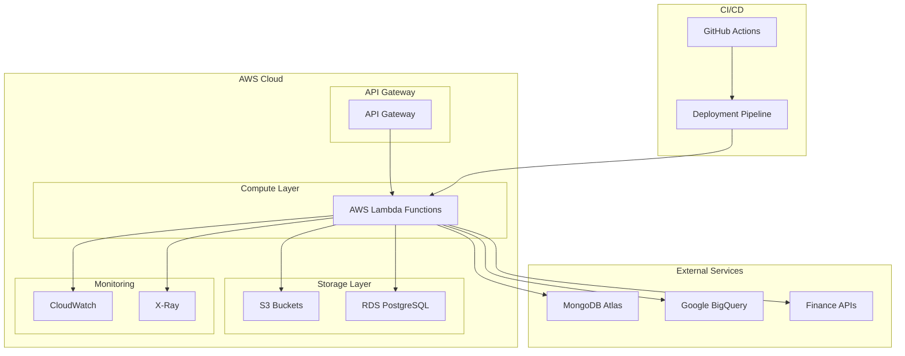
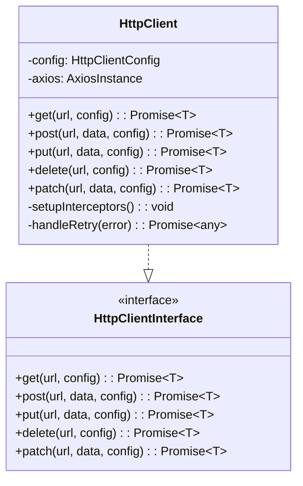
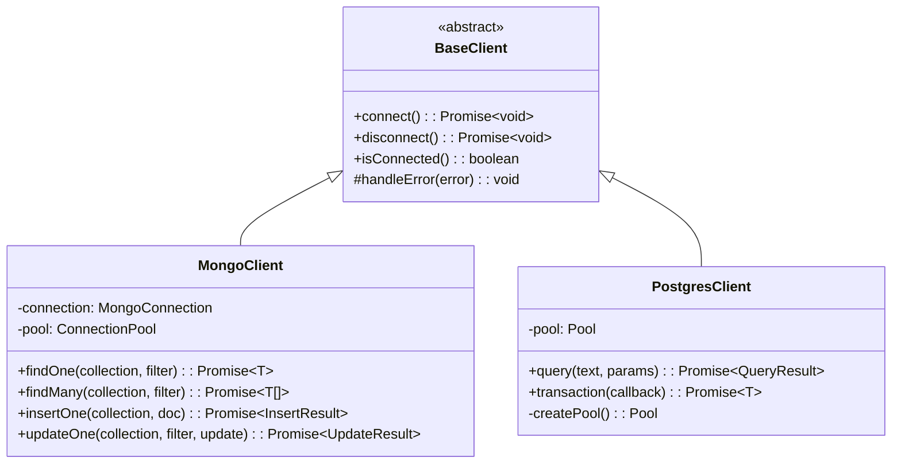
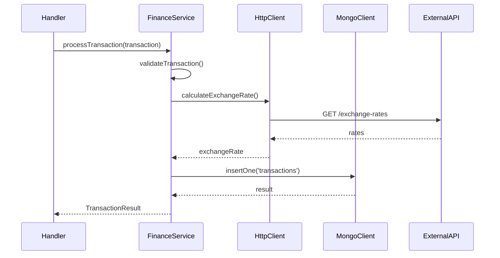
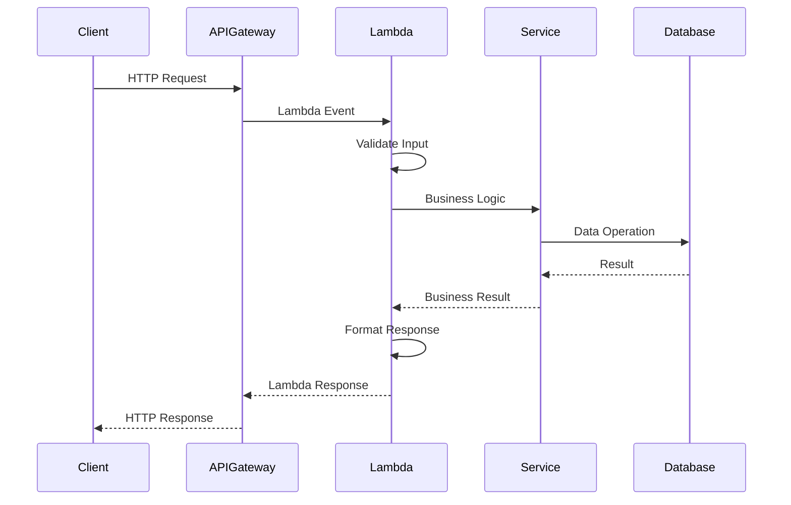
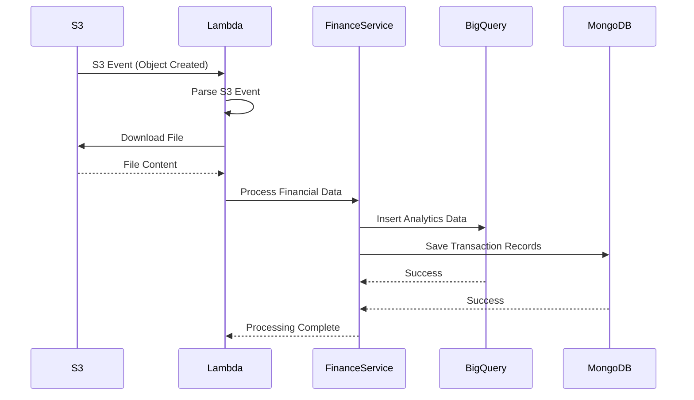
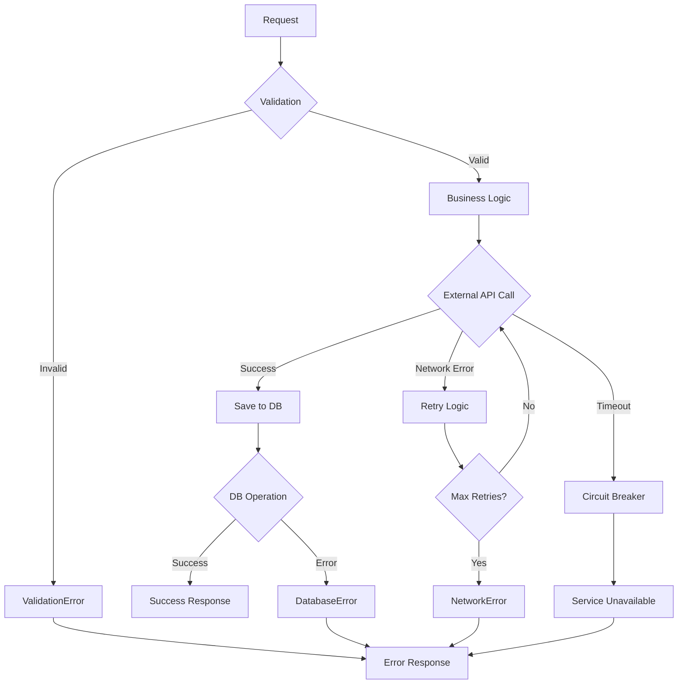

# Arquitectura del Sistema

## Visión General

El FBO Lambda Template es una arquitectura serverless diseñada para el ecosistema financiero de Yummy Inc. Implementa un patrón de capas limpio con separación clara de responsabilidades, optimizado para funciones AWS Lambda con alta disponibilidad, escalabilidad y observabilidad.

## Tabla de Contenidos

- [Principios Arquitectónicos](#principios-arquitectónicos)
- [Arquitectura de Alto Nivel](#arquitectura-de-alto-nivel)
- [Capas del Sistema](#capas-del-sistema)
- [Patrones de Diseño](#patrones-de-diseño)
- [Componentes Principales](#componentes-principales)
- [Flujo de Datos](#flujo-de-datos)
- [Integración de Servicios](#integración-de-servicios)
- [Seguridad](#seguridad)
- [Observabilidad](#observabilidad)
- [Escalabilidad](#escalabilidad)
- [Decisiones Arquitectónicas](#decisiones-arquitectónicas)

## Principios Arquitectónicos

### 1. **Separation of Concerns**

Cada capa tiene una responsabilidad específica y bien definida:

- **Presentation Layer**: Manejo de eventos Lambda y respuestas
- **Business Logic Layer**: Lógica de negocio y reglas financieras
- **Data Access Layer**: Acceso a bases de datos y servicios externos

### 2. **Dependency Inversion**

Las capas superiores no dependen de implementaciones concretas sino de abstracciones:

```typescript
// ✅ Correcto - Depende de abstracción
interface PaymentService {
  processPayment(payment: Payment): Promise<PaymentResult>;
}

// ❌ Incorrecto - Depende de implementación concreta
class PaymentHandler {
  constructor(private stripeClient: StripeClient) {}
}
```

### 3. **Single Responsibility**

Cada clase y módulo tiene una única razón para cambiar:

- `HttpClient`: Solo manejo de comunicación HTTP
- `MongoClient`: Solo operaciones MongoDB
- `FinanceService`: Solo lógica financiera

### 4. **Open/Closed Principle**

Abierto para extensión, cerrado para modificación:

```typescript
// Extensible mediante factory pattern
interface ClientFactory {
  createClient(type: ClientType): BaseClient;
}
```

### 5. **Fail Fast & Graceful Degradation**

- Validación temprana de inputs
- Circuit breakers para servicios externos
- Fallbacks para operaciones críticas

## Arquitectura de Alto Nivel



## Capas del Sistema

### 1. **Presentation Layer (Handlers)**

**Responsabilidad**: Manejo de eventos Lambda, validación de entrada, formateo de respuestas.

```typescript
// src/handlers/index.ts
export const handler = async (event: LambdaEvent, context: Context): Promise<LambdaResponse> => {
  const logger = createLogger();
  logger.setContext({ requestId: context.awsRequestId });

  try {
    // 1. Validar evento
    const validatedEvent = validateEvent(event);

    // 2. Enrutar a servicio apropiado
    const result = await routeToService(validatedEvent);

    // 3. Formatear respuesta
    return createSuccessResponse(result);
  } catch (error) {
    logger.error('Handler error', error);
    return createErrorResponse(error);
  }
};
```

**Características**:

- Stateless
- Validación de entrada con Zod schemas
- Logging estructurado
- Manejo centralizado de errores
- Respuestas consistentes

### 2. **Business Logic Layer (Services)**

**Responsabilidad**: Implementación de reglas de negocio, orquestación de operaciones, lógica financiera.

```typescript
// src/services/finance.service.ts
export class FinanceService implements FinanceServiceInterface {
  constructor(
    private readonly httpClient: HttpClientInterface,
    private readonly mongoClient: MongoClientInterface,
    private readonly logger: Logger
  ) {}

  async processTransaction(transaction: Transaction): Promise<TransactionResult> {
    // 1. Validar transacción
    await this.validateTransaction(transaction);

    // 2. Calcular fees
    const fees = await this.calculateFees(transaction);

    // 3. Procesar con proveedor externo
    const result = await this.processWithProvider(transaction);

    // 4. Guardar en base de datos
    await this.saveTransaction(transaction, result);

    return result;
  }
}
```

**Características**:

- Inyección de dependencias
- Transacciones atómicas
- Validación de reglas de negocio
- Manejo de estados
- Logging de operaciones

### 3. **Data Access Layer (Clients)**

**Responsabilidad**: Comunicación con bases de datos, APIs externas y servicios de almacenamiento.

```typescript
// src/clients/mongo.client.ts
export class MongoClient implements MongoClientInterface {
  private connection: MongoConnection;

  async findOne<T>(collection: string, filter: object): Promise<T | null> {
    try {
      const db = await this.getDatabase();
      return await db.collection(collection).findOne(filter);
    } catch (error) {
      throw new DatabaseError(`Failed to find document: ${error.message}`);
    }
  }
}
```

**Características**:

- Connection pooling
- Retry logic con backoff exponencial
- Circuit breakers
- Timeouts configurables
- Manejo de errores específicos

## Patrones de Diseño

### 1. **Factory Pattern**

Para la creación de clientes y servicios:

```typescript
// src/factories/client.factory.ts
export class ClientFactory {
  static createHttpClient(config?: HttpClientConfig): HttpClient {
    return new HttpClient({
      timeout: config?.timeout ?? 30000,
      retries: config?.retries ?? 3,
      ...config,
    });
  }

  static async createMongoClient(): Promise<MongoClient> {
    const client = new MongoClient(process.env.MONGODB_URI!);
    await client.connect();
    return client;
  }
}
```

### 2. **Singleton Pattern**

Para instancias compartidas como loggers y configuración:

```typescript
// src/utils/logger.util.ts
class LoggerSingleton {
  private static instance: Logger;

  static getInstance(): Logger {
    if (!LoggerSingleton.instance) {
      LoggerSingleton.instance = new Logger({
        level: process.env.LOG_LEVEL || 'info',
        format: 'json',
      });
    }
    return LoggerSingleton.instance;
  }
}
```

### 3. **Strategy Pattern**

Para diferentes estrategias de procesamiento:

```typescript
// src/strategies/payment.strategy.ts
interface PaymentStrategy {
  process(payment: Payment): Promise<PaymentResult>;
}

class CreditCardStrategy implements PaymentStrategy {
  async process(payment: Payment): Promise<PaymentResult> {
    // Lógica específica para tarjetas de crédito
  }
}

class BankTransferStrategy implements PaymentStrategy {
  async process(payment: Payment): Promise<PaymentResult> {
    // Lógica específica para transferencias bancarias
  }
}
```

### 4. **Observer Pattern**

Para eventos y notificaciones:

```typescript
// src/events/event.emitter.ts
class EventEmitter {
  private listeners: Map<string, Function[]> = new Map();

  on(event: string, listener: Function): void {
    const listeners = this.listeners.get(event) || [];
    listeners.push(listener);
    this.listeners.set(event, listeners);
  }

  emit(event: string, data: any): void {
    const listeners = this.listeners.get(event) || [];
    listeners.forEach((listener) => listener(data));
  }
}
```

### 5. **Repository Pattern**

Para abstracción de acceso a datos:

```typescript
// src/repositories/transaction.repository.ts
interface TransactionRepository {
  save(transaction: Transaction): Promise<void>;
  findById(id: string): Promise<Transaction | null>;
  findByStatus(status: TransactionStatus): Promise<Transaction[]>;
}

class MongoTransactionRepository implements TransactionRepository {
  constructor(private mongoClient: MongoClient) {}

  async save(transaction: Transaction): Promise<void> {
    await this.mongoClient.insertOne('transactions', transaction);
  }
}
```

## Componentes Principales

### 1. **HTTP Client**



**Características**:

- Retry automático con backoff exponencial
- Interceptores para logging y autenticación
- Timeout configurable
- Validación de respuestas
- Circuit breaker integrado

### 2. **Database Clients**



### 3. **Finance Service**



## Flujo de Datos

### 1. **Flujo de Request HTTP**



### 2. **Flujo de Procesamiento S3**



### 3. **Flujo de Error Handling**



## Integración de Servicios

### 1. **Servicios AWS**

```typescript
// Configuración de servicios AWS
const awsConfig = {
  region: process.env.AWS_REGION || 'us-east-1',
  credentials: {
    accessKeyId: process.env.AWS_ACCESS_KEY_ID!,
    secretAccessKey: process.env.AWS_SECRET_ACCESS_KEY!,
  },
};

// S3 Client
const s3Client = new S3Client(awsConfig);

// CloudWatch Logs
const cloudWatchLogs = new CloudWatchLogsClient(awsConfig);
```

### 2. **Bases de Datos Externas**

```typescript
// MongoDB Atlas
const mongoConfig = {
  uri: process.env.MONGODB_URI!,
  options: {
    maxPoolSize: 10,
    serverSelectionTimeoutMS: 5000,
    socketTimeoutMS: 45000,
  },
};

// PostgreSQL RDS
const postgresConfig = {
  host: process.env.POSTGRES_HOST!,
  port: parseInt(process.env.POSTGRES_PORT!),
  database: process.env.POSTGRES_DATABASE!,
  user: process.env.POSTGRES_USER!,
  password: process.env.POSTGRES_PASSWORD!,
  max: 20, // pool size
  idleTimeoutMillis: 30000,
  connectionTimeoutMillis: 2000,
};
```

### 3. **APIs Externas**

```typescript
// Finance API Integration
const financeApiConfig = {
  baseURL: process.env.FINANCE_API_URL!,
  timeout: 10000,
  headers: {
    Authorization: `Bearer ${process.env.FINANCE_API_KEY!}`,
    'Content-Type': 'application/json',
  },
  retries: 3,
  retryDelay: 1000,
};
```

## Seguridad

### 1. **Autenticación y Autorización**

```typescript
// JWT Token Validation
const validateToken = async (token: string): Promise<TokenPayload> => {
  try {
    const decoded = jwt.verify(token, process.env.JWT_SECRET!);
    return decoded as TokenPayload;
  } catch (error) {
    throw new AuthenticationError('Invalid token');
  }
};

// Role-based Access Control
const checkPermissions = (user: User, resource: string, action: string): boolean => {
  const permissions = user.roles.flatMap((role) => role.permissions);
  return permissions.some((p) => p.resource === resource && p.actions.includes(action));
};
```

### 2. **Validación de Entrada**

```typescript
// Zod Schemas para validación
const TransactionSchema = z.object({
  id: z.string().uuid(),
  amount: z.number().positive(),
  currency: z.enum(['USD', 'EUR', 'COP']),
  fromAccount: z.string().min(1),
  toAccount: z.string().min(1),
  type: z.enum(['transfer', 'payment', 'refund']),
});

// Sanitización de inputs
const sanitizeInput = (input: string): string => {
  return input
    .trim()
    .replace(/[<>"'&]/g, '')
    .substring(0, 1000); // Limitar longitud
};
```

### 3. **Secrets Management**

```typescript
// AWS Secrets Manager
const getSecret = async (secretName: string): Promise<string> => {
  const client = new SecretsManagerClient({ region: 'us-east-1' });
  const response = await client.send(new GetSecretValueCommand({ SecretId: secretName }));
  return response.SecretString!;
};

// Environment Variables Validation
const validateEnvironment = (): void => {
  const required = ['NODE_ENV', 'MONGODB_URI', 'POSTGRES_HOST', 'AWS_REGION', 'FINANCE_API_URL'];

  const missing = required.filter((key) => !process.env[key]);
  if (missing.length > 0) {
    throw new Error(`Missing environment variables: ${missing.join(', ')}`);
  }
};
```

## Observabilidad

### 1. **Logging Estructurado**

```typescript
// Logger Configuration
const logger = createLogger({
  level: process.env.LOG_LEVEL || 'info',
  format: 'json',
  defaultMeta: {
    service: 'fbo-lambda-template',
    version: process.env.APP_VERSION || '1.0.0',
  },
  transports: [
    new CloudWatchTransport({
      logGroupName: '/aws/lambda/fbo-lambda-template',
      logStreamName: () => new Date().toISOString().split('T')[0],
    }),
  ],
});

// Structured Logging
logger.info('Transaction processed', {
  transactionId: 'txn_123',
  amount: 1000.0,
  currency: 'USD',
  duration: 1250,
  status: 'completed',
});
```

### 2. **Métricas y Monitoreo**

```typescript
// Custom Metrics
const publishMetric = async (metricName: string, value: number, unit: string) => {
  const cloudWatch = new CloudWatchClient({ region: 'us-east-1' });

  await cloudWatch.send(
    new PutMetricDataCommand({
      Namespace: 'FBO/Lambda',
      MetricData: [
        {
          MetricName: metricName,
          Value: value,
          Unit: unit,
          Timestamp: new Date(),
          Dimensions: [
            {
              Name: 'Environment',
              Value: process.env.NODE_ENV!,
            },
          ],
        },
      ],
    })
  );
};

// Performance Monitoring
const measurePerformance = async <T>(operation: string, fn: () => Promise<T>): Promise<T> => {
  const start = Date.now();
  try {
    const result = await fn();
    const duration = Date.now() - start;

    await publishMetric(`${operation}.Duration`, duration, 'Milliseconds');
    await publishMetric(`${operation}.Success`, 1, 'Count');

    return result;
  } catch (error) {
    const duration = Date.now() - start;

    await publishMetric(`${operation}.Duration`, duration, 'Milliseconds');
    await publishMetric(`${operation}.Error`, 1, 'Count');

    throw error;
  }
};
```

### 3. **Distributed Tracing**

```typescript
// AWS X-Ray Integration
import AWSXRay from 'aws-xray-sdk-core';

// Instrumentar HTTP calls
const http = AWSXRay.captureHTTPs(require('http'));
const https = AWSXRay.captureHTTPs(require('https'));

// Instrumentar AWS SDK
const AWS = AWSXRay.captureAWS(require('aws-sdk'));

// Custom Subsegments
const traceOperation = async <T>(name: string, fn: () => Promise<T>): Promise<T> => {
  const subsegment = AWSXRay.getSegment()?.addNewSubsegment(name);

  try {
    const result = await fn();
    subsegment?.close();
    return result;
  } catch (error) {
    subsegment?.addError(error);
    subsegment?.close();
    throw error;
  }
};
```

## Escalabilidad

### 1. **Horizontal Scaling**

```yaml
# serverless.yml - Lambda Configuration
functions:
  processTransaction:
    handler: dist/index.handler
    reservedConcurrency: 100
    provisionedConcurrency: 10
    timeout: 30
    memorySize: 1024
    environment:
      NODE_ENV: ${self:provider.stage}
    events:
      - http:
          path: /transactions
          method: post
          cors: true
```

### 2. **Connection Pooling**

```typescript
// Database Connection Pools
const mongoPool = {
  maxPoolSize: 10,
  minPoolSize: 2,
  maxIdleTimeMS: 30000,
  serverSelectionTimeoutMS: 5000,
};

const postgresPool = {
  max: 20,
  min: 5,
  idleTimeoutMillis: 30000,
  connectionTimeoutMillis: 2000,
};
```

### 3. **Caching Strategy**

```typescript
// In-Memory Cache
class MemoryCache {
  private cache = new Map<string, { value: any; expiry: number }>();

  set(key: string, value: any, ttlMs: number): void {
    this.cache.set(key, {
      value,
      expiry: Date.now() + ttlMs,
    });
  }

  get(key: string): any | null {
    const item = this.cache.get(key);
    if (!item || Date.now() > item.expiry) {
      this.cache.delete(key);
      return null;
    }
    return item.value;
  }
}

// Redis Cache (para múltiples instancias)
const redisClient = new Redis({
  host: process.env.REDIS_HOST,
  port: parseInt(process.env.REDIS_PORT!),
  retryDelayOnFailover: 100,
  maxRetriesPerRequest: 3,
});
```

## Decisiones Arquitectónicas

### 1. **¿Por qué Serverless?**

**Decisión**: Usar AWS Lambda para compute

**Razones**:

- **Escalabilidad automática**: No necesidad de gestionar infraestructura
- **Costo optimizado**: Pago por uso real
- **Tiempo de desarrollo**: Enfoque en lógica de negocio
- **Integración nativa**: Con servicios AWS

**Trade-offs**:

- ✅ Menor overhead operacional
- ✅ Escalabilidad automática
- ❌ Cold starts
- ❌ Límites de tiempo de ejecución

### 2. **¿Por qué TypeScript?**

**Decisión**: TypeScript como lenguaje principal

**Razones**:

- **Type Safety**: Detección temprana de errores
- **Developer Experience**: Mejor autocompletado e IntelliSense
- **Refactoring**: Más seguro y eficiente
- **Documentación**: Los tipos sirven como documentación

**Trade-offs**:

- ✅ Menos bugs en producción
- ✅ Mejor mantenibilidad
- ❌ Tiempo de compilación adicional
- ❌ Curva de aprendizaje

### 3. **¿Por qué Múltiples Bases de Datos?**

**Decisión**: MongoDB + PostgreSQL + BigQuery

**Razones**:

- **MongoDB**: Documentos flexibles para datos transaccionales
- **PostgreSQL**: Datos relacionales y transacciones ACID
- **BigQuery**: Analytics y reporting de grandes volúmenes

**Trade-offs**:

- ✅ Optimización por caso de uso
- ✅ Mejor performance
- ❌ Complejidad adicional
- ❌ Múltiples tecnologías que mantener

### 4. **¿Por qué Layered Architecture?**

**Decisión**: Arquitectura en capas con separación clara

**Razones**:

- **Separation of Concerns**: Cada capa tiene responsabilidad específica
- **Testabilidad**: Fácil mockear dependencias
- **Mantenibilidad**: Cambios aislados por capa
- **Reutilización**: Componentes reutilizables

**Trade-offs**:

- ✅ Código más organizado
- ✅ Fácil testing
- ❌ Más boilerplate
- ❌ Posible over-engineering para casos simples

### 5. **¿Por qué Factory Pattern?**

**Decisión**: Factory pattern para creación de instancias

**Razones**:

- **Configuración centralizada**: Un lugar para configurar clientes
- **Dependency Injection**: Fácil intercambio de implementaciones
- **Testing**: Fácil mockear en tests
- **Singleton cuando necesario**: Reutilización de conexiones

**Trade-offs**:

- ✅ Mejor testabilidad
- ✅ Configuración centralizada
- ❌ Complejidad adicional
- ❌ Indirección extra

## Roadmap Arquitectónico

### Corto Plazo (1-3 meses)

- [ ] Implementar Circuit Breaker pattern
- [ ] Agregar cache distribuido (Redis)
- [ ] Métricas custom en CloudWatch
- [ ] Health checks automatizados

### Medio Plazo (3-6 meses)

- [ ] Event-driven architecture con SQS/SNS
- [ ] API versioning strategy
- [ ] Blue/Green deployments
- [ ] Chaos engineering tests

### Largo Plazo (6-12 meses)

- [ ] Microservices decomposition
- [ ] Event sourcing para auditoría
- [ ] Machine learning integration
- [ ] Multi-region deployment

## Conclusión

La arquitectura del FBO Lambda Template está diseñada para ser:

- **Escalable**: Maneja carga variable automáticamente
- **Mantenible**: Código organizado y bien estructurado
- **Observable**: Logging, métricas y tracing completos
- **Segura**: Validación, autenticación y autorización robustas
- **Eficiente**: Optimizada para costos y performance

Esta arquitectura proporciona una base sólida para el desarrollo de aplicaciones financieras serverless, permitiendo al equipo enfocarse en la lógica de negocio mientras mantiene altos estándares de calidad y seguridad.

---

**Mantenido por**: Financial Backoffice Team  
**Tech Lead**: José Carrillo <jose.carrillo@yummysuperapp.com>  
**Última actualización**: Agosto 2025  
**Versión**: 1.0.0
