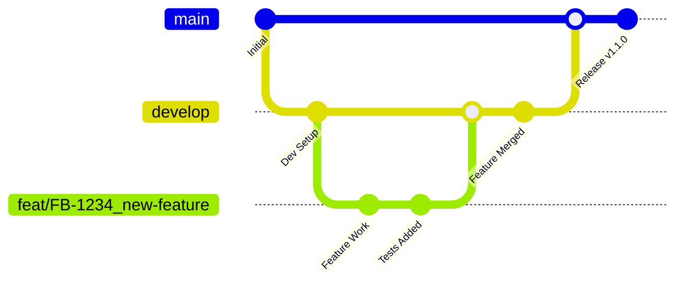

# Guía de Despliegue

## Visión General

Este documento describe los procesos de despliegue, pipelines de CI/CD y gestión de infraestructura para el proyecto FBO Lambda Template.

## Tabla de Contenidos

- [Estrategia de Ramas](#estrategia-de-ramas)
- [Pipeline CI/CD](#pipeline-cicd)
- [Configuración de Entornos](#configuración-de-entornos)
- [Métodos de Despliegue](#métodos-de-despliegue)
- [Infraestructura como Código](#infraestructura-como-código)
- [Monitoreo y Observabilidad](#monitoreo-y-observabilidad)
- [Procedimientos de Rollback](#procedimientos-de-rollback)
- [Consideraciones de Seguridad](#consideraciones-de-seguridad)
- [Solución de Problemas](#solución-de-problemas)

## Estrategia de Ramas

### Convención de Nomenclatura de Ramas

Seguimos una convención estricta de nomenclatura de ramas con el prefijo **FB-**:

#### Ramas de Funcionalidades

```
feat/FB-[NUMERO-JIRA]_[descripcion-corta]
```

**Ejemplo:** `feat/FB-1234_add-payment-validation`

#### Ramas de Corrección de Errores

```
fix/FB-[NUMERO-JIRA]_[descripcion-corta]
```

**Ejemplo:** `fix/FB-5678_resolve-connection-timeout`

#### Ramas de Hotfix

```
hotfix/FB-[NUMERO-JIRA]_[descripcion-corta]
```

**Ejemplo:** `hotfix/FB-9999_critical-security-patch`

### Validación de Ramas

Nuestro pipeline de CI/CD valida automáticamente los nombres de las ramas usando el workflow `.github/workflows/branch-naming.yml`:

- ✅ Valida el formato del prefijo FB-
- ✅ Asegura que el número de ticket JIRA esté presente
- ✅ Verifica el prefijo apropiado del tipo de rama
- ❌ Bloquea PRs con nombres de rama inválidos

#### Workflow de Validación

```yaml
name: Branch Naming Validation
on:
  pull_request:
    branches: [main, develop]

jobs:
  validate-branch-name:
    runs-on: ubuntu-latest
    steps:
      - name: Check branch name
        run: |
          if [[ ! "${{ github.head_ref }}" =~ ^(feat|fix|hotfix)/FB-[0-9]+_.+ ]]; then
            echo "❌ Nombre de rama inválido: ${{ github.head_ref }}"
            echo "✅ Formato esperado: feat/FB-1234_descripcion"
            exit 1
          fi
          echo "✅ Nombre de rama válido: ${{ github.head_ref }}"
```

### Flujo de Trabajo de Ramas



## Pipeline CI/CD

### Etapas del Pipeline

Nuestro pipeline de CI/CD consta de las siguientes etapas:

#### 1. **Validación de Calidad de Código**

```yaml
code-quality:
  runs-on: ubuntu-latest
  steps:
    - name: Checkout code
      uses: actions/checkout@v4

    - name: Setup Node.js
      uses: actions/setup-node@v4
      with:
        node-version: '18'
        cache: 'npm'

    - name: Install dependencies
      run: npm ci

    - name: Run ESLint
      run: npm run lint

    - name: Run Prettier check
      run: npm run format:check

    - name: TypeScript compilation
      run: npm run build
```

#### 2. **Testing**

```yaml
testing:
  runs-on: ubuntu-latest
  needs: code-quality
  steps:
    - name: Run unit tests
      run: npm test

    - name: Run integration tests
      run: npm run test:integration

    - name: Generate coverage report
      run: npm run test:coverage

    - name: Upload coverage to Codecov
      uses: codecov/codecov-action@v3
      with:
        file: ./coverage/lcov.info
```

#### 3. **Análisis de Seguridad**

```yaml
security:
  runs-on: ubuntu-latest
  needs: testing
  steps:
    - name: Run security audit
      run: npm audit --audit-level=high

    - name: Run Snyk security scan
      uses: snyk/actions/node@master
      env:
        SNYK_TOKEN: ${{ secrets.SNYK_TOKEN }}
```

#### 4. **Build y Empaquetado**

```yaml
build:
  runs-on: ubuntu-latest
  needs: [code-quality, testing, security]
  steps:
    - name: Build application
      run: npm run build

    - name: Package Lambda function
      run: |
        zip -r lambda-package.zip dist/ node_modules/ package.json

    - name: Upload build artifacts
      uses: actions/upload-artifact@v3
      with:
        name: lambda-package
        path: lambda-package.zip
```

#### 5. **Despliegue**

```yaml
deploy:
  runs-on: ubuntu-latest
  needs: build
  if: github.ref == 'refs/heads/main'
  steps:
    - name: Configure AWS credentials
      uses: aws-actions/configure-aws-credentials@v2
      with:
        aws-access-key-id: ${{ secrets.AWS_ACCESS_KEY_ID }}
        aws-secret-access-key: ${{ secrets.AWS_SECRET_ACCESS_KEY }}
        aws-region: us-east-1

    - name: Deploy to AWS Lambda
      run: |
        aws lambda update-function-code \
          --function-name fbo-lambda-template \
          --zip-file fileb://lambda-package.zip
```

### Configuración de Entornos

#### Desarrollo (Development)

```bash
# Variables de entorno para desarrollo
NODE_ENV=development
AWS_REGION=us-east-1
LOG_LEVEL=debug

# Base de datos local
MONGODB_URI=mongodb://localhost:27017/fbo_dev
POSTGRES_HOST=localhost
POSTGRES_DATABASE=fbo_dev

# Servicios mock
USE_MOCK_SERVICES=true
MOCK_EXTERNAL_APIS=true
```

#### Staging

```bash
# Variables de entorno para staging
NODE_ENV=staging
AWS_REGION=us-east-1
LOG_LEVEL=info

# Bases de datos de staging
MONGODB_URI=${STAGING_MONGODB_URI}
POSTGRES_HOST=${STAGING_POSTGRES_HOST}

# Servicios reales con datos de prueba
USE_MOCK_SERVICES=false
API_BASE_URL=https://api-staging.yummysuperapp.com
```

#### Producción

```bash
# Variables de entorno para producción
NODE_ENV=production
AWS_REGION=us-east-1
LOG_LEVEL=warn

# Bases de datos de producción
MONGODB_URI=${PROD_MONGODB_URI}
POSTGRES_HOST=${PROD_POSTGRES_HOST}

# Servicios de producción
API_BASE_URL=https://api.yummysuperapp.com
ENABLE_MONITORING=true
```

### Variables de Entorno por Ambiente

| Variable         | Desarrollo  | Staging | Producción |
| ---------------- | ----------- | ------- | ---------- |
| `NODE_ENV`       | development | staging | production |
| `LOG_LEVEL`      | debug       | info    | warn       |
| `ENABLE_TRACING` | false       | true    | true       |
| `CACHE_TTL`      | 60          | 300     | 900        |
| `MAX_RETRIES`    | 1           | 3       | 5          |
| `TIMEOUT_MS`     | 5000        | 10000   | 15000      |

## Métodos de Despliegue

### 1. AWS SAM (Serverless Application Model)

#### Configuración SAM

```yaml
# template.yaml
AWSTemplateFormatVersion: '2010-09-09'
Transform: AWS::Serverless-2016-10-31

Globals:
  Function:
    Timeout: 30
    Runtime: nodejs18.x
    Environment:
      Variables:
        NODE_ENV: !Ref Environment
        LOG_LEVEL: !Ref LogLevel

Parameters:
  Environment:
    Type: String
    Default: development
    AllowedValues: [development, staging, production]

  LogLevel:
    Type: String
    Default: info
    AllowedValues: [debug, info, warn, error]

Resources:
  FBOLambdaFunction:
    Type: AWS::Serverless::Function
    Properties:
      CodeUri: dist/
      Handler: index.handler
      Environment:
        Variables:
          MONGODB_URI: !Ref MongoDBURI
          POSTGRES_HOST: !Ref PostgresHost
      Events:
        ApiEvent:
          Type: Api
          Properties:
            Path: /{proxy+}
            Method: ANY
```

#### Comandos de Despliegue SAM

```bash
# Build
sam build

# Deploy a desarrollo
sam deploy --parameter-overrides Environment=development

# Deploy a staging
sam deploy --parameter-overrides Environment=staging

# Deploy a producción
sam deploy --parameter-overrides Environment=production
```

### 2. Serverless Framework

#### Configuración Serverless

```yaml
# serverless.yml
service: fbo-lambda-template

provider:
  name: aws
  runtime: nodejs18.x
  region: ${opt:region, 'us-east-1'}
  stage: ${opt:stage, 'dev'}
  environment:
    NODE_ENV: ${self:provider.stage}
    MONGODB_URI: ${env:MONGODB_URI}
    POSTGRES_HOST: ${env:POSTGRES_HOST}

functions:
  main:
    handler: dist/index.handler
    timeout: 30
    events:
      - http:
          path: /{proxy+}
          method: ANY
          cors: true

plugins:
  - serverless-offline
  - serverless-webpack
  - serverless-dotenv-plugin
```

#### Comandos de Despliegue Serverless

```bash
# Deploy a desarrollo
serverless deploy --stage dev

# Deploy a staging
serverless deploy --stage staging

# Deploy a producción
serverless deploy --stage prod

# Deploy función específica
serverless deploy function --function main --stage prod
```

### 3. AWS CDK (Cloud Development Kit)

#### Stack CDK

```typescript
import * as cdk from 'aws-cdk-lib';
import * as lambda from 'aws-cdk-lib/aws-lambda';
import * as apigateway from 'aws-cdk-lib/aws-apigateway';

export class FBOLambdaStack extends cdk.Stack {
	constructor(scope: Construct, id: string, props?: cdk.StackProps) {
		super(scope, id, props);

		// Lambda Function
		const fboFunction = new lambda.Function(this, 'FBOLambdaFunction', {
			runtime: lambda.Runtime.NODEJS_18_X,
			handler: 'index.handler',
			code: lambda.Code.fromAsset('dist'),
			timeout: cdk.Duration.seconds(30),
			environment: {
				NODE_ENV: process.env.NODE_ENV || 'development',
				MONGODB_URI: process.env.MONGODB_URI || '',
				POSTGRES_HOST: process.env.POSTGRES_HOST || '',
			},
		});

		// API Gateway
		const api = new apigateway.RestApi(this, 'FBOApi', {
			restApiName: 'FBO Lambda Template API',
			description: 'API for FBO Lambda Template',
		});

		const integration = new apigateway.LambdaIntegration(fboFunction);
		api.root.addProxy({
			defaultIntegration: integration,
		});
	}
}
```

#### Comandos CDK

```bash
# Sintetizar template
cdk synth

# Deploy
cdk deploy --context environment=development
cdk deploy --context environment=staging
cdk deploy --context environment=production

# Destroy
cdk destroy
```

### 4. Despliegue Manual

#### Preparación del Paquete

```bash
# 1. Instalar dependencias
npm ci --production

# 2. Build del proyecto
npm run build

# 3. Crear paquete ZIP
zip -r lambda-package.zip dist/ node_modules/ package.json
```

#### Despliegue via AWS CLI

```bash
# Actualizar código de función
aws lambda update-function-code \
  --function-name fbo-lambda-template \
  --zip-file fileb://lambda-package.zip

# Actualizar configuración
aws lambda update-function-configuration \
  --function-name fbo-lambda-template \
  --environment Variables="{NODE_ENV=production,LOG_LEVEL=warn}"
```

## Infraestructura como Código

### Recursos AWS

#### Lambda Function

```yaml
FBOLambdaFunction:
  Type: AWS::Lambda::Function
  Properties:
    FunctionName: !Sub '${AWS::StackName}-fbo-lambda'
    Runtime: nodejs18.x
    Handler: index.handler
    Code:
      ZipFile: |
        exports.handler = async (event) => {
          return { statusCode: 200, body: 'Hello World' };
        };
    Timeout: 30
    MemorySize: 512
    Environment:
      Variables:
        NODE_ENV: !Ref Environment
        LOG_LEVEL: !Ref LogLevel
    Role: !GetAtt LambdaExecutionRole.Arn
```

#### IAM Role

```yaml
LambdaExecutionRole:
  Type: AWS::IAM::Role
  Properties:
    AssumeRolePolicyDocument:
      Version: '2012-10-17'
      Statement:
        - Effect: Allow
          Principal:
            Service: lambda.amazonaws.com
          Action: sts:AssumeRole
    ManagedPolicyArns:
      - arn:aws:iam::aws:policy/service-role/AWSLambdaBasicExecutionRole
    Policies:
      - PolicyName: FBOLambdaPolicy
        PolicyDocument:
          Version: '2012-10-17'
          Statement:
            - Effect: Allow
              Action:
                - s3:GetObject
                - s3:PutObject
              Resource: !Sub '${S3Bucket}/*'
            - Effect: Allow
              Action:
                - secretsmanager:GetSecretValue
              Resource: !Ref DatabaseSecrets
```

#### MongoDB Atlas

```yaml
# Configuración via Terraform
resource "mongodbatlas_cluster" "fbo_cluster" {
project_id   = var.atlas_project_id
name         = "fbo-lambda-${var.environment}"

cluster_type = "REPLICASET"
replication_specs {
num_shards = 1
regions_config {
region_name     = "US_EAST_1"
electable_nodes = 3
priority        = 7
read_only_nodes = 0
}
}

provider_backup_enabled      = true
auto_scaling_disk_gb_enabled = true
mongo_db_major_version       = "6.0"

provider_instance_size_name = var.cluster_size
provider_name               = "AWS"
}
```

#### PostgreSQL RDS

```yaml
PostgresDatabase:
  Type: AWS::RDS::DBInstance
  Properties:
    DBInstanceIdentifier: !Sub '${AWS::StackName}-postgres'
    DBInstanceClass: db.t3.micro
    Engine: postgres
    EngineVersion: '14.9'
    AllocatedStorage: 20
    StorageType: gp2
    StorageEncrypted: true

    DBName: !Ref DatabaseName
    MasterUsername: !Ref DatabaseUsername
    MasterUserPassword: !Ref DatabasePassword

    VPCSecurityGroups:
      - !Ref DatabaseSecurityGroup
    DBSubnetGroupName: !Ref DatabaseSubnetGroup

    BackupRetentionPeriod: 7
    MultiAZ: !If [IsProduction, true, false]
    DeletionProtection: !If [IsProduction, true, false]
```

## Monitoreo y Observabilidad

### CloudWatch Logs

#### Configuración de Log Groups

```yaml
LambdaLogGroup:
  Type: AWS::Logs::LogGroup
  Properties:
    LogGroupName: !Sub '/aws/lambda/${FBOLambdaFunction}'
    RetentionInDays: !If [IsProduction, 30, 7]
```

#### Structured Logging

```typescript
import { logger } from '@/utils/logger.util';

// Log de información
logger.info('Payment processed successfully', {
	paymentId: 'pay_123',
	amount: 100.0,
	currency: 'USD',
	timestamp: new Date().toISOString(),
});

// Log de error
logger.error('Payment processing failed', {
	paymentId: 'pay_123',
	error: error.message,
	stack: error.stack,
	timestamp: new Date().toISOString(),
});
```

### CloudWatch Metrics

#### Custom Metrics

```typescript
import AWS from 'aws-sdk';

const cloudwatch = new AWS.CloudWatch();

// Métrica de pagos procesados
const putMetric = async (metricName: string, value: number, unit: string = 'Count') => {
	await cloudwatch
		.putMetricData({
			Namespace: 'FBO/Lambda',
			MetricData: [
				{
					MetricName: metricName,
					Value: value,
					Unit: unit,
					Timestamp: new Date(),
				},
			],
		})
		.promise();
};

// Uso
await putMetric('PaymentsProcessed', 1);
await putMetric('PaymentAmount', 100.0, 'None');
await putMetric('ProcessingTime', 250, 'Milliseconds');
```

#### Dashboards

```yaml
FBODashboard:
  Type: AWS::CloudWatch::Dashboard
  Properties:
    DashboardName: FBO-Lambda-Template
    DashboardBody: !Sub |
      {
        "widgets": [
          {
            "type": "metric",
            "properties": {
              "metrics": [
                ["AWS/Lambda", "Invocations", "FunctionName", "${FBOLambdaFunction}"],
                ["AWS/Lambda", "Errors", "FunctionName", "${FBOLambdaFunction}"],
                ["AWS/Lambda", "Duration", "FunctionName", "${FBOLambdaFunction}"]
              ],
              "period": 300,
              "stat": "Sum",
              "region": "us-east-1",
              "title": "Lambda Metrics"
            }
          }
        ]
      }
```

### X-Ray Tracing

#### Configuración

```typescript
import AWSXRay from 'aws-xray-sdk-core';
import AWS from 'aws-sdk';

// Instrumentar AWS SDK
const instrumentedAWS = AWSXRay.captureAWS(AWS);

// Instrumentar HTTP requests
import { captureHTTPsGlobal } from 'aws-xray-sdk-httpclient';
captureHTTPsGlobal(require('https'));

// Crear subsegmentos
export const traceAsyncFunction = async (name: string, fn: () => Promise<any>) => {
	const segment = AWSXRay.getSegment();
	const subsegment = segment?.addNewSubsegment(name);

	try {
		const result = await fn();
		subsegment?.close();
		return result;
	} catch (error) {
		subsegment?.addError(error as Error);
		subsegment?.close();
		throw error;
	}
};
```

### Alertas

#### Configuración de Alarmas

```yaml
HighErrorRateAlarm:
  Type: AWS::CloudWatch::Alarm
  Properties:
    AlarmName: !Sub '${AWS::StackName}-high-error-rate'
    AlarmDescription: 'High error rate in Lambda function'
    MetricName: Errors
    Namespace: AWS/Lambda
    Statistic: Sum
    Period: 300
    EvaluationPeriods: 2
    Threshold: 5
    ComparisonOperator: GreaterThanThreshold
    Dimensions:
      - Name: FunctionName
        Value: !Ref FBOLambdaFunction
    AlarmActions:
      - !Ref SNSAlarmTopic

HighLatencyAlarm:
  Type: AWS::CloudWatch::Alarm
  Properties:
    AlarmName: !Sub '${AWS::StackName}-high-latency'
    AlarmDescription: 'High latency in Lambda function'
    MetricName: Duration
    Namespace: AWS/Lambda
    Statistic: Average
    Period: 300
    EvaluationPeriods: 3
    Threshold: 10000
    ComparisonOperator: GreaterThanThreshold
    Dimensions:
      - Name: FunctionName
        Value: !Ref FBOLambdaFunction
    AlarmActions:
      - !Ref SNSAlarmTopic
```

## Procedimientos de Rollback

### Rollback Automático

#### Configuración de Auto-Rollback

```yaml
LambdaAlias:
  Type: AWS::Lambda::Alias
  Properties:
    FunctionName: !Ref FBOLambdaFunction
    FunctionVersion: !GetAtt FBOLambdaVersion.Version
    Name: LIVE
    RoutingConfig:
      AdditionalVersionWeights:
        - FunctionVersion: !GetAtt PreviousLambdaVersion.Version
          FunctionWeight: 0.1 # 10% tráfico a versión anterior

AutoRollbackAlarm:
  Type: AWS::CloudWatch::Alarm
  Properties:
    AlarmName: !Sub '${AWS::StackName}-auto-rollback'
    MetricName: Errors
    Namespace: AWS/Lambda
    Statistic: Sum
    Period: 60
    EvaluationPeriods: 2
    Threshold: 3
    ComparisonOperator: GreaterThanThreshold
    AlarmActions:
      - !Ref RollbackTopic
```

### Rollback Manual

#### Via AWS CLI

```bash
# Listar versiones
aws lambda list-versions-by-function --function-name fbo-lambda-template

# Rollback a versión anterior
aws lambda update-alias \
  --function-name fbo-lambda-template \
  --name LIVE \
  --function-version 5

# Verificar rollback
aws lambda get-alias \
  --function-name fbo-lambda-template \
  --name LIVE
```

#### Via SAM

```bash
# Rollback usando SAM
sam deploy --parameter-overrides \
  FunctionVersion=5 \
  Environment=production
```

#### Procedimiento de Emergencia

1. **Identificar el Problema**

   ```bash
   # Revisar logs recientes
   aws logs filter-log-events \
     --log-group-name /aws/lambda/fbo-lambda-template \
     --start-time $(date -d '10 minutes ago' +%s)000
   ```

2. **Ejecutar Rollback**

   ```bash
   # Rollback inmediato
   aws lambda update-alias \
     --function-name fbo-lambda-template \
     --name LIVE \
     --function-version $PREVIOUS_VERSION
   ```

3. **Verificar Funcionalidad**

   ```bash
   # Test de salud
   curl -X GET https://api.yummysuperapp.com/health
   ```

4. **Notificar al Equipo**
   ```bash
   # Enviar notificación
   aws sns publish \
     --topic-arn arn:aws:sns:us-east-1:123456789012:fbo-alerts \
     --message "Rollback ejecutado en fbo-lambda-template"
   ```

## Consideraciones de Seguridad

### Gestión de Secretos

#### AWS Secrets Manager

```typescript
import AWS from 'aws-sdk';

const secretsManager = new AWS.SecretsManager();

export const getSecret = async (secretName: string): Promise<string> => {
	try {
		const result = await secretsManager
			.getSecretValue({
				SecretId: secretName,
			})
			.promise();

		return result.SecretString || '';
	} catch (error) {
		logger.error('Failed to retrieve secret', { secretName, error });
		throw error;
	}
};

// Uso
const dbPassword = await getSecret('fbo/database/password');
const apiKey = await getSecret('fbo/external-api/key');
```

#### Environment Variables Loader

```typescript
import { getSecret } from './secrets';

export const loadEnvironmentVariables = async () => {
	// Cargar secretos desde AWS Secrets Manager
	if (process.env.NODE_ENV === 'production') {
		process.env.MONGODB_PASSWORD = await getSecret('fbo/mongodb/password');
		process.env.POSTGRES_PASSWORD = await getSecret('fbo/postgres/password');
		process.env.API_KEY = await getSecret('fbo/external-api/key');
	}
};
```

### Políticas IAM

#### Principio de Menor Privilegio

```yaml
LambdaExecutionPolicy:
  Type: AWS::IAM::Policy
  Properties:
    PolicyName: FBOLambdaMinimalPolicy
    PolicyDocument:
      Version: '2012-10-17'
      Statement:
        # Logs básicos
        - Effect: Allow
          Action:
            - logs:CreateLogGroup
            - logs:CreateLogStream
            - logs:PutLogEvents
          Resource: !Sub 'arn:aws:logs:${AWS::Region}:${AWS::AccountId}:*'

        # Secretos específicos
        - Effect: Allow
          Action:
            - secretsmanager:GetSecretValue
          Resource:
            - !Sub 'arn:aws:secretsmanager:${AWS::Region}:${AWS::AccountId}:secret:fbo/*'

        # S3 bucket específico
        - Effect: Allow
          Action:
            - s3:GetObject
            - s3:PutObject
          Resource:
            - !Sub '${FBOBucket}/*'

        # X-Ray tracing
        - Effect: Allow
          Action:
            - xray:PutTraceSegments
            - xray:PutTelemetryRecords
          Resource: '*'
```

### Seguridad de Red

#### VPC Configuration

```yaml
LambdaVPCConfig:
  Type: AWS::Lambda::Function
  Properties:
    VpcConfig:
      SecurityGroupIds:
        - !Ref LambdaSecurityGroup
      SubnetIds:
        - !Ref PrivateSubnet1
        - !Ref PrivateSubnet2

LambdaSecurityGroup:
  Type: AWS::EC2::SecurityGroup
  Properties:
    GroupDescription: Security group for FBO Lambda
    VpcId: !Ref VPC
    SecurityGroupEgress:
      # HTTPS para APIs externas
      - IpProtocol: tcp
        FromPort: 443
        ToPort: 443
        CidrIp: 0.0.0.0/0

      # MongoDB Atlas
      - IpProtocol: tcp
        FromPort: 27017
        ToPort: 27017
        SourceSecurityGroupId: !Ref MongoDBSecurityGroup

      # PostgreSQL RDS
      - IpProtocol: tcp
        FromPort: 5432
        ToPort: 5432
        SourceSecurityGroupId: !Ref PostgreSQLSecurityGroup
```

## Solución de Problemas

### Problemas Comunes

#### 1. **Timeout de Lambda**

**Síntomas:**

- Error: "Task timed out after X seconds"
- Logs cortados abruptamente

**Soluciones:**

```bash
# Aumentar timeout
aws lambda update-function-configuration \
  --function-name fbo-lambda-template \
  --timeout 60

# Optimizar código
# - Usar connection pooling
# - Implementar caching
# - Optimizar queries de base de datos
```

#### 2. **Errores de Memoria**

**Síntomas:**

- Error: "Runtime exited with error: signal: killed"
- Logs de memoria insuficiente

**Soluciones:**

```bash
# Aumentar memoria
aws lambda update-function-configuration \
  --function-name fbo-lambda-template \
  --memory-size 1024

# Optimizar uso de memoria
# - Liberar referencias no utilizadas
# - Usar streams para archivos grandes
# - Implementar garbage collection manual
```

#### 3. **Errores de Conexión a Base de Datos**

**Síntomas:**

- Error: "Connection timeout"
- Error: "Too many connections"

**Soluciones:**

```typescript
// Implementar connection pooling
import { MongoClient } from 'mongodb';

let cachedClient: MongoClient | null = null;

export const getMongoClient = async (): Promise<MongoClient> => {
	if (cachedClient) {
		return cachedClient;
	}

	cachedClient = new MongoClient(process.env.MONGODB_URI!, {
		maxPoolSize: 10,
		minPoolSize: 2,
		maxIdleTimeMS: 30000,
		serverSelectionTimeoutMS: 5000,
	});

	await cachedClient.connect();
	return cachedClient;
};
```

#### 4. **Errores de Permisos**

**Síntomas:**

- Error: "AccessDenied"
- Error: "User is not authorized"

**Soluciones:**

```bash
# Verificar políticas IAM
aws iam get-role-policy \
  --role-name lambda-execution-role \
  --policy-name lambda-policy

# Agregar permisos necesarios
aws iam put-role-policy \
  --role-name lambda-execution-role \
  --policy-name additional-permissions \
  --policy-document file://policy.json
```

### Herramientas de Debugging

#### 1. **CloudWatch Insights**

```sql
-- Buscar errores recientes
fields @timestamp, @message
| filter @message like /ERROR/
| sort @timestamp desc
| limit 20

-- Analizar latencia
fields @timestamp, @duration
| filter @type = "REPORT"
| stats avg(@duration), max(@duration), min(@duration) by bin(5m)
```

#### 2. **X-Ray Service Map**

```bash
# Obtener traces recientes
aws xray get-trace-summaries \
  --time-range-type TimeRangeByStartTime \
  --start-time $(date -d '1 hour ago' +%s) \
  --end-time $(date +%s)
```

#### 3. **Local Testing**

```bash
# Ejecutar localmente con SAM
sam local start-api --env-vars env.json

# Test específico
sam local invoke FBOLambdaFunction --event events/test-event.json
```

### Optimización de Rendimiento

#### 1. **Cold Start Optimization**

```typescript
// Inicialización fuera del handler
const mongoClient = new MongoClient(process.env.MONGODB_URI!);
const httpClient = axios.create({ timeout: 5000 });

// Handler optimizado
export const handler = async (event: APIGatewayProxyEvent) => {
	// Lógica del handler
};
```

#### 2. **Bundle Size Optimization**

```javascript
// webpack.config.js
module.exports = {
	target: 'node',
	mode: 'production',
	externals: ['aws-sdk'], // Excluir AWS SDK
	optimization: {
		minimize: true,
		usedExports: true,
		sideEffects: false,
	},
};
```

#### 3. **Monitoring Continuo**

```typescript
// Métricas personalizadas
const startTime = Date.now();

try {
	// Lógica de negocio
	const result = await processPayment(payment);

	// Métrica de éxito
	await putMetric('PaymentSuccess', 1);

	return result;
} catch (error) {
	// Métrica de error
	await putMetric('PaymentError', 1);
	throw error;
} finally {
	// Métrica de latencia
	const duration = Date.now() - startTime;
	await putMetric('PaymentDuration', duration, 'Milliseconds');
}
```

---

## Soporte y Contacto

Para preguntas sobre despliegue o problemas técnicos:

- **Tech Lead:** José Carrillo <jose.carrillo@yummysuperapp.com>
- **Equipo:** Financial Backoffice
- **Slack:** #fbo-team
- **Documentación:** [Confluence FBO](https://yummy.atlassian.net/wiki/spaces/FBO)

---

_Última actualización: Agosto 2025_
_Versión: 1.0.0_
_Próxima revisión: Agosto 2025_
