# Guía de Testing

## Visión General

Esta guía describe la estrategia de testing, configuración y mejores prácticas para el proyecto FBO Lambda Template. Utilizamos **Vitest** como framework principal de testing junto con herramientas complementarias para asegurar la calidad del código.

> **Nota Importante:** Aunque esta documentación está en español, todo el código, incluyendo comentarios, variables, nombres de funciones y cualquier otro elemento programático, debe estar escrito en **inglés**.

## Tabla de Contenidos

- [Estrategia de Testing](#estrategia-de-testing)
- [Configuración de Vitest](#configuración-de-vitest)
- [Estructura de Directorios](#estructura-de-directorios)
- [Tipos de Pruebas](#tipos-de-pruebas)
- [Cobertura de Código](#cobertura-de-código)
- [Mejores Prácticas](#mejores-prácticas)
- [Integración con CI/CD](#integración-con-cicd)
- [Debugging de Pruebas](#debugging-de-pruebas)
- [Testing de Rendimiento](#testing-de-rendimiento)
- [Testing de Seguridad](#testing-de-seguridad)
- [Solución de Problemas](#solución-de-problemas)

## Estrategia de Testing

### Pirámide de Testing

Seguimos la pirámide de testing tradicional con énfasis en pruebas unitarias:

```mermaid
graph TD
    A["🔺 E2E Tests (5%)"] --> B["🔸 Integration Tests (25%)"]
    B --> C["🔹 Unit Tests (70%)"]

    style A fill:#ff6b6b
    style B fill:#4ecdc4
    style C fill:#45b7d1
```



#### Distribución de Pruebas

- **70% Pruebas Unitarias**: Funciones individuales, clases y módulos
- **25% Pruebas de Integración**: Interacciones entre componentes
- **5% Pruebas E2E**: Flujos completos de usuario

### Principios de Testing

1. **Fast**: Las pruebas deben ejecutarse rápidamente
2. **Independent**: Cada prueba debe ser independiente
3. **Repeatable**: Resultados consistentes en cualquier entorno
4. **Self-Validating**: Resultado claro (pass/fail)
5. **Timely**: Escritas junto con el código de producción

## Configuración de Vitest

### Archivo de Configuración

**Archivo:** `vitest.config.ts`

```typescript
import { defineConfig } from 'vitest/config';
import path from 'path';

export default defineConfig({
	test: {
		// Entorno de testing
		environment: 'node',

		// Archivos de configuración
		setupFiles: ['./src/test/setup.ts'],

		// Patrones de archivos de prueba
		include: ['src/**/*.{test,spec}.{js,ts}', 'tests/**/*.{test,spec}.{js,ts}'],

		// Archivos a excluir
		exclude: ['node_modules', 'dist', '.git', 'coverage'],

		// Configuración de cobertura
		coverage: {
			provider: 'v8',
			reporter: ['text', 'json', 'html', 'lcov'],
			reportsDirectory: './coverage',
			exclude: ['node_modules/', 'src/test/', '**/*.d.ts', '**/*.config.{js,ts}', '**/index.ts'],
			thresholds: {
				global: {
					branches: 80,
					functions: 80,
					lines: 80,
					statements: 80,
				},
			},
		},

		// Configuración de reporters
		reporters: ['verbose', 'junit'],
		outputFile: {
			junit: './test-results/junit.xml',
		},

		// Timeout para pruebas
		testTimeout: 10000,
		hookTimeout: 10000,

		// Configuración de mocks
		globals: true,
		mockReset: true,
		restoreMocks: true,
	},

	// Resolución de paths
	resolve: {
		alias: {
			'@': path.resolve(__dirname, './src'),
			'@test': path.resolve(__dirname, './src/test'),
		},
	},
});
```

### Setup de Testing

**Archivo:** `src/test/setup.ts`

```typescript
import { beforeAll, afterAll, beforeEach, afterEach } from 'vitest';
import { MongoMemoryServer } from 'mongodb-memory-server';
import { MongoClient } from 'mongodb';
import dotenv from 'dotenv';

// Cargar variables de entorno de testing
dotenv.config({ path: '.env.test' });

// MongoDB en memoria para testing
let mongoServer: MongoMemoryServer;
let mongoClient: MongoClient;

beforeAll(async () => {
	// Inicializar MongoDB en memoria
	mongoServer = await MongoMemoryServer.create();
	const mongoUri = mongoServer.getUri();

	// Configurar cliente de MongoDB
	mongoClient = new MongoClient(mongoUri);
	await mongoClient.connect();

	// Configurar variables de entorno para testing
	process.env.MONGODB_URI = mongoUri;
	process.env.NODE_ENV = 'test';
	process.env.LOG_LEVEL = 'silent';
});

afterAll(async () => {
	// Limpiar recursos
	if (mongoClient) {
		await mongoClient.close();
	}
	if (mongoServer) {
		await mongoServer.stop();
	}
});

beforeEach(async () => {
	// Limpiar base de datos antes de cada prueba
	if (mongoClient) {
		const db = mongoClient.db();
		const collections = await db.listCollections().toArray();

		for (const collection of collections) {
			await db.collection(collection.name).deleteMany({});
		}
	}
});

afterEach(() => {
	// Limpiar mocks después de cada prueba
	vi.clearAllMocks();
});
```

## Estructura de Directorios

### Organización de Archivos de Prueba

```
src/
├── controllers/
│   ├── payment.controller.ts
│   └── payment.controller.test.ts
├── services/
│   ├── payment.service.ts
│   └── payment.service.test.ts
├── utils/
│   ├── validation.util.ts
│   └── validation.util.test.ts
├── test/
│   ├── setup.ts
│   ├── helpers/
│   │   ├── test-data.helper.ts
│   │   └── mock.helper.ts
│   └── fixtures/
│       ├── payment.fixture.ts
│       └── user.fixture.ts
└── __tests__/
    ├── integration/
    │   ├── payment-flow.test.ts
    │   └── database.test.ts
    └── e2e/
        └── api.test.ts
```

### Convenciones de Nombres

#### Archivos de Prueba

- **Pruebas Unitarias**: `*.test.ts` (co-ubicadas con el código)
- **Pruebas de Integración**: `*.integration.test.ts`
- **Pruebas E2E**: `*.e2e.test.ts`
- **Fixtures**: `*.fixture.ts`
- **Helpers**: `*.helper.ts`

#### Nombres de Pruebas

```typescript
// ✅ Buena práctica
describe('PaymentService', () => {
	describe('processPayment', () => {
		it('should process valid payment successfully', () => {
			// Test implementation
		});

		it('should throw error when payment amount is negative', () => {
			// Test implementation
		});
	});
});

// ❌ Mala práctica
describe('Payment tests', () => {
	it('test payment', () => {
		// Test implementation
	});
});
```

## Tipos de Pruebas

### 1. Pruebas Unitarias

#### Ejemplo: Testing de Servicio

```typescript
// src/services/payment.service.test.ts
import { describe, it, expect, vi, beforeEach } from 'vitest';
import { PaymentService } from './payment.service';
import { PaymentRepository } from '../repositories/payment.repository';
import { NotificationService } from './notification.service';

// Mock de dependencias
vi.mock('../repositories/payment.repository');
vi.mock('./notification.service');

describe('PaymentService', () => {
	let paymentService: PaymentService;
	let mockPaymentRepository: vi.Mocked<PaymentRepository>;
	let mockNotificationService: vi.Mocked<NotificationService>;

	beforeEach(() => {
		mockPaymentRepository = vi.mocked(new PaymentRepository());
		mockNotificationService = vi.mocked(new NotificationService());
		paymentService = new PaymentService(mockPaymentRepository, mockNotificationService);
	});

	describe('processPayment', () => {
		it('should process valid payment successfully', async () => {
			// Arrange
			const paymentData = {
				amount: 100.0,
				currency: 'USD',
				paymentMethod: 'credit_card',
				customerId: 'cust_123',
			};

			const expectedPayment = {
				id: 'pay_123',
				...paymentData,
				status: 'completed',
				createdAt: new Date(),
			};

			mockPaymentRepository.create.mockResolvedValue(expectedPayment);
			mockNotificationService.sendPaymentConfirmation.mockResolvedValue(true);

			// Act
			const result = await paymentService.processPayment(paymentData);

			// Assert
			expect(result).toEqual(expectedPayment);
			expect(mockPaymentRepository.create).toHaveBeenCalledWith(paymentData);
			expect(mockNotificationService.sendPaymentConfirmation).toHaveBeenCalledWith(expectedPayment);
		});

		it('should throw error when payment amount is negative', async () => {
			// Arrange
			const invalidPaymentData = {
				amount: -50.0,
				currency: 'USD',
				paymentMethod: 'credit_card',
				customerId: 'cust_123',
			};

			// Act & Assert
			await expect(paymentService.processPayment(invalidPaymentData)).rejects.toThrow(
				'Payment amount must be positive'
			);

			expect(mockPaymentRepository.create).not.toHaveBeenCalled();
		});

		it('should handle repository errors gracefully', async () => {
			// Arrange
			const paymentData = {
				amount: 100.0,
				currency: 'USD',
				paymentMethod: 'credit_card',
				customerId: 'cust_123',
			};

			mockPaymentRepository.create.mockRejectedValue(new Error('Database connection failed'));

			// Act & Assert
			await expect(paymentService.processPayment(paymentData)).rejects.toThrow('Failed to process payment');
		});
	});
});
```

#### Ejemplo: Testing de Utilidades

```typescript
// src/utils/validation.util.test.ts
import { describe, it, expect } from 'vitest';
import { validateEmail, validatePaymentAmount, sanitizeInput } from './validation.util';

describe('ValidationUtil', () => {
	describe('validateEmail', () => {
		it('should return true for valid email addresses', () => {
			const validEmails = ['user@example.com', 'test.email+tag@domain.co.uk', 'user123@test-domain.com'];

			validEmails.forEach((email) => {
				expect(validateEmail(email)).toBe(true);
			});
		});

		it('should return false for invalid email addresses', () => {
			const invalidEmails = ['invalid-email', '@domain.com', 'user@', 'user..double.dot@domain.com'];

			invalidEmails.forEach((email) => {
				expect(validateEmail(email)).toBe(false);
			});
		});
	});

	describe('validatePaymentAmount', () => {
		it('should return true for valid payment amounts', () => {
			expect(validatePaymentAmount(10.5)).toBe(true);
			expect(validatePaymentAmount(1000)).toBe(true);
			expect(validatePaymentAmount(0.01)).toBe(true);
		});

		it('should return false for invalid payment amounts', () => {
			expect(validatePaymentAmount(-10)).toBe(false);
			expect(validatePaymentAmount(0)).toBe(false);
			expect(validatePaymentAmount(NaN)).toBe(false);
			expect(validatePaymentAmount(Infinity)).toBe(false);
		});
	});

	describe('sanitizeInput', () => {
		it('should remove dangerous characters from input', () => {
			expect(sanitizeInput('<script>alert("xss")</script>test')).toBe('test');
			expect(sanitizeInput('normal text')).toBe('normal text');
		});

		it('should handle null and undefined inputs', () => {
			expect(sanitizeInput(null)).toBe('');
			expect(sanitizeInput(undefined)).toBe('');
		});
	});
});
```

### 2. Pruebas de Integración

#### Ejemplo: Testing de Base de Datos

```typescript
// src/__tests__/integration/payment-repository.integration.test.ts
import { describe, it, expect, beforeEach } from 'vitest';
import { MongoClient, Db } from 'mongodb';
import { PaymentRepository } from '../../repositories/payment.repository';
import { createTestPayment } from '../../test/fixtures/payment.fixture';

describe('PaymentRepository Integration', () => {
	let db: Db;
	let paymentRepository: PaymentRepository;

	beforeEach(async () => {
		// La configuración de MongoDB en memoria se maneja en setup.ts
		const client = new MongoClient(process.env.MONGODB_URI!);
		await client.connect();
		db = client.db();
		paymentRepository = new PaymentRepository(db);
	});

	describe('create', () => {
		it('should create payment in database', async () => {
			// Arrange
			const paymentData = createTestPayment();

			// Act
			const createdPayment = await paymentRepository.create(paymentData);

			// Assert
			expect(createdPayment).toMatchObject(paymentData);
			expect(createdPayment.id).toBeDefined();
			expect(createdPayment.createdAt).toBeInstanceOf(Date);

			// Verificar que se guardó en la base de datos
			const savedPayment = await db.collection('payments').findOne({ _id: createdPayment.id });
			expect(savedPayment).toBeTruthy();
		});

		it('should throw error when creating duplicate payment', async () => {
			// Arrange
			const paymentData = createTestPayment({ externalId: 'unique_123' });
			await paymentRepository.create(paymentData);

			// Act & Assert
			await expect(paymentRepository.create(paymentData)).rejects.toThrow('Payment with external ID already exists');
		});
	});

	describe('findById', () => {
		it('should find payment by ID', async () => {
			// Arrange
			const paymentData = createTestPayment();
			const createdPayment = await paymentRepository.create(paymentData);

			// Act
			const foundPayment = await paymentRepository.findById(createdPayment.id);

			// Assert
			expect(foundPayment).toEqual(createdPayment);
		});

		it('should return null when payment not found', async () => {
			// Act
			const foundPayment = await paymentRepository.findById('non_existent_id');

			// Assert
			expect(foundPayment).toBeNull();
		});
	});
});
```

### 3. Pruebas End-to-End (E2E)

#### Ejemplo: Testing de API

```typescript
// src/__tests__/e2e/payment-api.e2e.test.ts
import { describe, it, expect, beforeAll, afterAll } from 'vitest';
import request from 'supertest';
import { app } from '../../app';
import { createTestUser, createTestPayment } from '../../test/fixtures';

describe('Payment API E2E', () => {
	let authToken: string;
	let testUser: any;

	beforeAll(async () => {
		// Configurar usuario de prueba y autenticación
		testUser = await createTestUser();
		const loginResponse = await request(app).post('/auth/login').send({
			email: testUser.email,
			password: 'test_password',
		});

		authToken = loginResponse.body.token;
	});

	describe('POST /api/payments', () => {
		it('should create payment successfully', async () => {
			// Arrange
			const paymentData = {
				amount: 100.0,
				currency: 'USD',
				paymentMethod: 'credit_card',
				description: 'Test payment',
			};

			// Act
			const response = await request(app)
				.post('/api/payments')
				.set('Authorization', `Bearer ${authToken}`)
				.send(paymentData)
				.expect(201);

			// Assert
			expect(response.body).toMatchObject({
				id: expect.any(String),
				amount: paymentData.amount,
				currency: paymentData.currency,
				status: 'pending',
				createdAt: expect.any(String),
			});
		});

		it('should return 400 for invalid payment data', async () => {
			// Arrange
			const invalidPaymentData = {
				amount: -50, // Invalid negative amount
				currency: 'INVALID',
				paymentMethod: '',
			};

			// Act
			const response = await request(app)
				.post('/api/payments')
				.set('Authorization', `Bearer ${authToken}`)
				.send(invalidPaymentData)
				.expect(400);

			// Assert
			expect(response.body).toMatchObject({
				error: 'Validation failed',
				details: expect.arrayContaining([
					expect.objectContaining({
						field: 'amount',
						message: expect.stringContaining('must be positive'),
					}),
				]),
			});
		});

		it('should return 401 for unauthenticated requests', async () => {
			// Arrange
			const paymentData = createTestPayment();

			// Act & Assert
			await request(app).post('/api/payments').send(paymentData).expect(401);
		});
	});

	describe('GET /api/payments/:id', () => {
		it('should retrieve payment by ID', async () => {
			// Arrange
			const paymentData = createTestPayment();
			const createResponse = await request(app)
				.post('/api/payments')
				.set('Authorization', `Bearer ${authToken}`)
				.send(paymentData);

			const paymentId = createResponse.body.id;

			// Act
			const response = await request(app)
				.get(`/api/payments/${paymentId}`)
				.set('Authorization', `Bearer ${authToken}`)
				.expect(200);

			// Assert
			expect(response.body).toMatchObject({
				id: paymentId,
				amount: paymentData.amount,
				currency: paymentData.currency,
			});
		});

		it('should return 404 for non-existent payment', async () => {
			// Act & Assert
			await request(app).get('/api/payments/non_existent_id').set('Authorization', `Bearer ${authToken}`).expect(404);
		});
	});
});
```

## Cobertura de Código

### Configuración de Cobertura

La cobertura se configura en `vitest.config.ts` con los siguientes umbrales mínimos:

- **Líneas**: 80%
- **Funciones**: 80%
- **Ramas**: 80%
- **Declaraciones**: 80%

### Comandos de Cobertura

```bash
# Ejecutar pruebas con cobertura
npm run test:coverage

# Generar reporte HTML
npm run test:coverage:html

# Ver reporte en el navegador
npm run test:coverage:open
```

### Reportes de Cobertura

#### Configuración de Reportes

```typescript
// vitest.config.ts
coverage: {
  provider: 'v8',
  reporter: [
    'text',        // Consola
    'json',        // JSON para CI/CD
    'html',        // Reporte HTML
    'lcov',        // Para herramientas externas
    'text-summary' // Resumen en consola
  ],
  reportsDirectory: './coverage',

  // Archivos a excluir de cobertura
  exclude: [
    'node_modules/',
    'src/test/',
    '**/*.d.ts',
    '**/*.config.{js,ts}',
    '**/index.ts',
    'src/types/',
    'src/constants/'
  ]
}
```

#### Análisis de Cobertura

```bash
# Ejemplo de salida de cobertura
% Coverage report from v8
-----------------------|---------|----------|---------|---------|-------------------
File                   | % Stmts | % Branch | % Funcs | % Lines | Uncovered Line #s
-----------------------|---------|----------|---------|---------|-------------------
All files              |   85.23 |    78.45 |   89.12 |   85.67 |
 controllers/           |   92.15 |    85.71 |   95.00 |   92.30 |
  payment.controller.ts |   92.15 |    85.71 |   95.00 |   92.30 | 45-47,52
 services/              |   88.76 |    82.35 |   90.00 |   89.12 |
  payment.service.ts    |   88.76 |    82.35 |   90.00 |   89.12 | 78,95-98
 utils/                 |   75.45 |    65.22 |   80.00 |   76.12 |
  validation.util.ts    |   75.45 |    65.22 |   80.00 |   76.12 | 23-25,45-50
-----------------------|---------|----------|---------|---------|-------------------
```

## Mejores Prácticas

### 1. Organización de Pruebas

#### Estructura AAA (Arrange-Act-Assert)

```typescript
// ✅ Buena práctica
it('should calculate total with tax correctly', () => {
	// Arrange
	const baseAmount = 100;
	const taxRate = 0.08;
	const calculator = new TaxCalculator();

	// Act
	const result = calculator.calculateTotal(baseAmount, taxRate);

	// Assert
	expect(result).toBe(108);
});

// ❌ Mala práctica
it('tax calculation', () => {
	expect(new TaxCalculator().calculateTotal(100, 0.08)).toBe(108);
});
```

#### Nombres Descriptivos

```typescript
// ✅ Buena práctica
describe('PaymentValidator', () => {
	describe('validateCreditCard', () => {
		it('should return true when credit card number is valid', () => {
			// Test implementation
		});

		it('should return false when credit card number has invalid checksum', () => {
			// Test implementation
		});

		it('should throw error when credit card number is null', () => {
			// Test implementation
		});
	});
});

// ❌ Mala práctica
describe('Validator', () => {
	it('test1', () => {
		// Test implementation
	});

	it('test2', () => {
		// Test implementation
	});
});
```

### 2. Mocking Efectivo

#### Mock de Dependencias Externas

```typescript
// src/test/helpers/mock.helper.ts
import { vi } from 'vitest';

// Mock de AWS SDK
export const mockAWSS3 = {
	upload: vi.fn().mockResolvedValue({ Location: 'https://s3.amazonaws.com/bucket/file.jpg' }),
	deleteObject: vi.fn().mockResolvedValue({}),
	getObject: vi.fn().mockResolvedValue({ Body: Buffer.from('file content') }),
};

// Mock de servicios HTTP
export const mockHttpClient = {
	get: vi.fn(),
	post: vi.fn(),
	put: vi.fn(),
	delete: vi.fn(),
};

// Mock de base de datos
export const mockDatabase = {
	collection: vi.fn().mockReturnValue({
		findOne: vi.fn(),
		find: vi.fn(),
		insertOne: vi.fn(),
		updateOne: vi.fn(),
		deleteOne: vi.fn(),
	}),
};
```

#### Uso de Mocks en Pruebas

```typescript
import { describe, it, expect, vi, beforeEach } from 'vitest';
import { FileUploadService } from './file-upload.service';
import { mockAWSS3 } from '../test/helpers/mock.helper';

// Mock del módulo AWS
vi.mock('aws-sdk', () => ({
	S3: vi.fn().mockImplementation(() => mockAWSS3),
}));

describe('FileUploadService', () => {
	let fileUploadService: FileUploadService;

	beforeEach(() => {
		vi.clearAllMocks();
		fileUploadService = new FileUploadService();
	});

	it('should upload file to S3 successfully', async () => {
		// Arrange
		const fileBuffer = Buffer.from('test file content');
		const fileName = 'test-file.txt';
		const expectedUrl = 'https://s3.amazonaws.com/bucket/test-file.txt';

		mockAWSS3.upload.mockResolvedValue({ Location: expectedUrl });

		// Act
		const result = await fileUploadService.uploadFile(fileBuffer, fileName);

		// Assert
		expect(result).toBe(expectedUrl);
		expect(mockAWSS3.upload).toHaveBeenCalledWith({
			Bucket: expect.any(String),
			Key: fileName,
			Body: fileBuffer,
			ContentType: 'text/plain',
		});
	});
});
```

### 3. Datos de Prueba

#### Factory Pattern para Fixtures

```typescript
// src/test/fixtures/payment.fixture.ts
import { faker } from '@faker-js/faker';
import { Payment, PaymentStatus } from '../../types/payment.types';

export interface PaymentFixtureOptions {
	amount?: number;
	currency?: string;
	status?: PaymentStatus;
	customerId?: string;
	paymentMethod?: string;
}

export const createTestPayment = (options: PaymentFixtureOptions = {}): Partial<Payment> => {
	return {
		id: options.id || faker.string.uuid(),
		amount: options.amount || faker.number.float({ min: 1, max: 1000, precision: 0.01 }),
		currency: options.currency || 'USD',
		status: options.status || 'pending',
		customerId: options.customerId || faker.string.uuid(),
		paymentMethod: options.paymentMethod || 'credit_card',
		description: faker.commerce.productDescription(),
		createdAt: faker.date.recent(),
		updatedAt: faker.date.recent(),
	};
};

export const createTestPaymentList = (count: number = 5): Partial<Payment>[] => {
	return Array.from({ length: count }, () => createTestPayment());
};

// Fixtures específicos
export const createCompletedPayment = (options: PaymentFixtureOptions = {}) => {
	return createTestPayment({
		...options,
		status: 'completed',
		completedAt: faker.date.recent(),
	});
};

export const createFailedPayment = (options: PaymentFixtureOptions = {}) => {
	return createTestPayment({
		...options,
		status: 'failed',
		failureReason: faker.lorem.sentence(),
	});
};
```

### 4. Testing Asíncrono

#### Pruebas con Promises

```typescript
describe('AsyncPaymentService', () => {
	it('should process payment asynchronously', async () => {
		// Arrange
		const paymentData = createTestPayment();
		const paymentService = new AsyncPaymentService();

		// Act
		const result = await paymentService.processPaymentAsync(paymentData);

		// Assert
		expect(result.status).toBe('completed');
		expect(result.processedAt).toBeInstanceOf(Date);
	});

	it('should handle async errors properly', async () => {
		// Arrange
		const invalidPaymentData = createTestPayment({ amount: -100 });
		const paymentService = new AsyncPaymentService();

		// Act & Assert
		await expect(paymentService.processPaymentAsync(invalidPaymentData)).rejects.toThrow('Invalid payment amount');
	});
});
```

#### Testing con Timeouts

```typescript
it('should timeout after specified duration', async () => {
	// Arrange
	const slowService = new SlowPaymentService();
	const paymentData = createTestPayment();

	// Act & Assert
	await expect(slowService.processWithTimeout(paymentData, 1000)).rejects.toThrow('Operation timed out');
}, 2000); // Test timeout de 2 segundos
```

### 5. Testing de Snapshot

#### Configuración de Snapshots

```typescript
// src/utils/response.util.test.ts
import { describe, it, expect } from 'vitest';
import { formatApiResponse, formatErrorResponse } from './response.util';
import { createTestPayment } from '../test/fixtures/payment.fixture';

describe('ResponseUtil', () => {
	describe('formatApiResponse', () => {
		it('should format successful payment response correctly', () => {
			// Arrange
			const payment = createTestPayment({
				id: 'pay_123',
				amount: 100.0,
				currency: 'USD',
				status: 'completed',
			});

			// Act
			const response = formatApiResponse(payment, 'Payment processed successfully');

			// Assert
			expect(response).toMatchSnapshot();
		});

		it('should format error response correctly', () => {
			// Arrange
			const error = new Error('Payment validation failed');
			const details = {
				field: 'amount',
				code: 'INVALID_AMOUNT',
			};

			// Act
			const response = formatErrorResponse(error, 400, details);

			// Assert
			expect(response).toMatchSnapshot();
		});
	});
});
```

## Integración con CI/CD

### GitHub Actions Workflow

**Archivo:** `.github/workflows/test.yml`

```yaml
name: Test Suite

on:
  push:
    branches: [main, develop]
  pull_request:
    branches: [main, develop]

jobs:
  test:
    runs-on: ubuntu-latest

    strategy:
      matrix:
        node-version: [18.x, 20.x]

    steps:
      - name: Checkout code
        uses: actions/checkout@v4

      - name: Setup Node.js ${{ matrix.node-version }}
        uses: actions/setup-node@v4
        with:
          node-version: ${{ matrix.node-version }}
          cache: 'npm'

      - name: Install dependencies
        run: npm ci

      - name: Run linting
        run: npm run lint

      - name: Run type checking
        run: npm run type-check

      - name: Run unit tests
        run: npm run test:unit

      - name: Run integration tests
        run: npm run test:integration
        env:
          NODE_ENV: test

      - name: Run coverage
        run: npm run test:coverage

      - name: Upload coverage to Codecov
        uses: codecov/codecov-action@v3
        with:
          file: ./coverage/lcov.info
          flags: unittests
          name: codecov-umbrella

      - name: Upload test results
        uses: actions/upload-artifact@v3
        if: always()
        with:
          name: test-results-${{ matrix.node-version }}
          path: |
            test-results/
            coverage/

      - name: Comment PR with coverage
        if: github.event_name == 'pull_request'
        uses: romeovs/lcov-reporter-action@v0.3.1
        with:
          github-token: ${{ secrets.GITHUB_TOKEN }}
          lcov-file: ./coverage/lcov.info
```

### Scripts de Package.json

```json
{
	"scripts": {
		"test": "vitest",
		"test:unit": "vitest run --reporter=verbose",
		"test:integration": "vitest run --config vitest.integration.config.ts",
		"test:e2e": "vitest run --config vitest.e2e.config.ts",
		"test:watch": "vitest --watch",
		"test:coverage": "vitest run --coverage",
		"test:coverage:html": "vitest run --coverage --reporter=html",
		"test:coverage:open": "npm run test:coverage:html && open coverage/index.html",
		"test:ui": "vitest --ui",
		"test:debug": "vitest --inspect-brk --no-coverage"
	}
}
```

### Configuración de Calidad

#### SonarQube Integration

```yaml
# sonar-project.properties
sonar.projectKey=fbo-lambda-template
sonar.projectName=FBO Lambda Template
sonar.projectVersion=1.0.0

# Configuración de código fuente
sonar.sources=src
sonar.tests=src
sonar.test.inclusions=**/*.test.ts,**/*.spec.ts
sonar.exclusions=**/*.test.ts,**/*.spec.ts,**/node_modules/**,**/coverage/**

# Configuración de cobertura
sonar.javascript.lcov.reportPaths=coverage/lcov.info
sonar.testExecutionReportPaths=test-results/sonar-report.xml

# Configuración de calidad
sonar.coverage.exclusions=**/*.test.ts,**/*.spec.ts,**/test/**,**/*.config.ts
```

## Debugging de Pruebas

### Configuración de VS Code

**Archivo:** `.vscode/launch.json`

```json
{
	"version": "0.2.0",
	"configurations": [
		{
			"name": "Debug Vitest Tests",
			"type": "node",
			"request": "launch",
			"program": "${workspaceFolder}/node_modules/vitest/vitest.mjs",
			"args": ["run", "--no-coverage", "--reporter=verbose"],
			"cwd": "${workspaceFolder}",
			"console": "integratedTerminal",
			"env": {
				"NODE_ENV": "test"
			},
			"skipFiles": ["<node_internals>/**"]
		},
		{
			"name": "Debug Current Test File",
			"type": "node",
			"request": "launch",
			"program": "${workspaceFolder}/node_modules/vitest/vitest.mjs",
			"args": ["run", "${relativeFile}", "--no-coverage"],
			"cwd": "${workspaceFolder}",
			"console": "integratedTerminal",
			"env": {
				"NODE_ENV": "test"
			}
		}
	]
}
```

### Comandos de Debugging

```bash
# Debug con Node.js inspector
node --inspect-brk ./node_modules/vitest/vitest.mjs run --no-coverage

# Debug prueba específica
npm run test:debug -- payment.service.test.ts

# Debug con logs detallados
DEBUG=* npm run test

# Debug con breakpoints
npm run test:debug -- --reporter=verbose
```

### Herramientas de Debugging

#### Console Debugging

```typescript
// Debugging temporal en pruebas
it('should debug payment processing', async () => {
	const paymentData = createTestPayment();

	console.log('Payment data:', JSON.stringify(paymentData, null, 2));

	const result = await paymentService.processPayment(paymentData);

	console.log('Result:', JSON.stringify(result, null, 2));

	expect(result.status).toBe('completed');
});
```

#### Vitest UI

```bash
# Ejecutar interfaz web de Vitest
npm run test:ui

# Abrir en navegador
open http://localhost:51204/__vitest__/
```

## Testing de Rendimiento

### Pruebas de Carga

```typescript
// src/__tests__/performance/payment-load.test.ts
import { describe, it, expect } from 'vitest';
import { performance } from 'perf_hooks';
import { PaymentService } from '../../services/payment.service';
import { createTestPayment } from '../../test/fixtures/payment.fixture';

describe('Payment Performance Tests', () => {
	const paymentService = new PaymentService();

	it('should process 100 payments within acceptable time', async () => {
		// Arrange
		const payments = Array.from({ length: 100 }, () => createTestPayment());
		const maxExecutionTime = 5000; // 5 segundos

		// Act
		const startTime = performance.now();

		const results = await Promise.all(payments.map((payment) => paymentService.processPayment(payment)));

		const endTime = performance.now();
		const executionTime = endTime - startTime;

		// Assert
		expect(results).toHaveLength(100);
		expect(executionTime).toBeLessThan(maxExecutionTime);
		expect(results.every((result) => result.status === 'completed')).toBe(true);

		console.log(`Processed 100 payments in ${executionTime.toFixed(2)}ms`);
	});

	it('should handle concurrent payment processing efficiently', async () => {
		// Arrange
		const concurrentPayments = 50;
		const payments = Array.from({ length: concurrentPayments }, () => createTestPayment());

		// Act
		const startTime = performance.now();

		const results = await Promise.allSettled(payments.map((payment) => paymentService.processPayment(payment)));

		const endTime = performance.now();
		const executionTime = endTime - startTime;

		// Assert
		const successfulResults = results.filter((result) => result.status === 'fulfilled');
		expect(successfulResults.length).toBeGreaterThan(concurrentPayments * 0.95); // 95% success rate
		expect(executionTime).toBeLessThan(3000); // 3 segundos máximo
	});
});
```

### Pruebas de Uso de Memoria

```typescript
// src/__tests__/performance/memory-usage.test.ts
import { describe, it, expect } from 'vitest';
import { PaymentProcessor } from '../../services/payment-processor.service';
import { createTestPaymentList } from '../../test/fixtures/payment.fixture';

describe('Memory Usage Tests', () => {
	it('should not exceed memory limits when processing large datasets', async () => {
		// Arrange
		const largePaymentList = createTestPaymentList(10000);
		const processor = new PaymentProcessor();
		const initialMemory = process.memoryUsage().heapUsed;
		const maxMemoryIncrease = 100 * 1024 * 1024; // 100MB

		// Act
		await processor.processBatch(largePaymentList);

		// Force garbage collection if available
		if (global.gc) {
			global.gc();
		}

		const finalMemory = process.memoryUsage().heapUsed;
		const memoryIncrease = finalMemory - initialMemory;

		// Assert
		expect(memoryIncrease).toBeLessThan(maxMemoryIncrease);

		console.log(`Memory increase: ${(memoryIncrease / 1024 / 1024).toFixed(2)}MB`);
	});
});
```

## Testing de Seguridad

### Pruebas de Validación de Entrada

```typescript
// src/__tests__/security/input-validation.test.ts
import { describe, it, expect } from 'vitest';
import { PaymentController } from '../../controllers/payment.controller';
import { createMockRequest, createMockResponse } from '../../test/helpers/express.helper';

describe('Input Validation Security Tests', () => {
	const paymentController = new PaymentController();

	describe('SQL Injection Prevention', () => {
		it('should reject SQL injection attempts in payment description', async () => {
			// Arrange
			const maliciousPayload = {
				amount: 100,
				currency: 'USD',
				description: "'; DROP TABLE payments; --",
			};

			const req = createMockRequest({ body: maliciousPayload });
			const res = createMockResponse();

			// Act
			await paymentController.createPayment(req, res);

			// Assert
			expect(res.status).toHaveBeenCalledWith(400);
			expect(res.json).toHaveBeenCalledWith(
				expect.objectContaining({
					error: 'Invalid input detected',
				})
			);
		});
	});

	describe('XSS Prevention', () => {
		it('should sanitize script tags in input fields', async () => {
			// Arrange
			const xssPayload = {
				amount: 100,
				currency: 'USD',
				description: '<script>alert("XSS")</script>',
			};

			const req = createMockRequest({ body: xssPayload });
			const res = createMockResponse();

			// Act
			await paymentController.createPayment(req, res);

			// Assert
			expect(res.status).toHaveBeenCalledWith(400);
		});
	});

	describe('Input Size Limits', () => {
		it('should reject oversized input fields', async () => {
			// Arrange
			const oversizedPayload = {
				amount: 100,
				currency: 'USD',
				description: 'A'.repeat(10000), // 10KB description
			};

			const req = createMockRequest({ body: oversizedPayload });
			const res = createMockResponse();

			// Act
			await paymentController.createPayment(req, res);

			// Assert
			expect(res.status).toHaveBeenCalledWith(400);
			expect(res.json).toHaveBeenCalledWith(
				expect.objectContaining({
					error: 'Input size exceeds limit',
				})
			);
		});
	});
});
```

### Pruebas de Autenticación y Autorización

```typescript
// src/__tests__/security/auth.test.ts
import { describe, it, expect, beforeEach } from 'vitest';
import { AuthMiddleware } from '../../middleware/auth.middleware';
import { createMockRequest, createMockResponse } from '../../test/helpers/express.helper';

describe('Authentication Security Tests', () => {
	let authMiddleware: AuthMiddleware;

	beforeEach(() => {
		authMiddleware = new AuthMiddleware();
	});

	describe('JWT Token Validation', () => {
		it('should reject invalid JWT tokens', async () => {
			// Arrange
			const req = createMockRequest({
				headers: {
					authorization: 'Bearer invalid.jwt.token',
				},
			});
			const res = createMockResponse();
			const next = vi.fn();

			// Act
			await authMiddleware.validateToken(req, res, next);

			// Assert
			expect(res.status).toHaveBeenCalledWith(401);
			expect(next).not.toHaveBeenCalled();
		});

		it('should reject expired JWT tokens', async () => {
			// Arrange
			const expiredToken =
				'eyJhbGciOiJIUzI1NiIsInR5cCI6IkpXVCJ9.eyJzdWIiOiIxMjM0NTY3ODkwIiwibmFtZSI6IkpvaG4gRG9lIiwiaWF0IjoxNTE2MjM5MDIyLCJleHAiOjE1MTYyMzkwMjJ9.invalid';

			const req = createMockRequest({
				headers: {
					authorization: `Bearer ${expiredToken}`,
				},
			});
			const res = createMockResponse();
			const next = vi.fn();

			// Act
			await authMiddleware.validateToken(req, res, next);

			// Assert
			expect(res.status).toHaveBeenCalledWith(401);
			expect(res.json).toHaveBeenCalledWith(
				expect.objectContaining({
					error: 'Token expired',
				})
			);
		});
	});

	describe('Rate Limiting', () => {
		it('should block requests exceeding rate limit', async () => {
			// Arrange
			const req = createMockRequest({
				ip: '192.168.1.1',
				headers: {
					authorization: 'Bearer valid.jwt.token',
				},
			});
			const res = createMockResponse();
			const next = vi.fn();

			// Simular múltiples requests
			for (let i = 0; i < 101; i++) {
				await authMiddleware.rateLimit(req, res, next);
			}

			// Assert
			expect(res.status).toHaveBeenCalledWith(429);
			expect(res.json).toHaveBeenCalledWith(
				expect.objectContaining({
					error: 'Rate limit exceeded',
				})
			);
		});
	});
});
```

## Solución de Problemas

### Problemas Comunes

#### 1. **Pruebas Lentas**

**Síntomas:**

- Tests que tardan más de 30 segundos
- Timeouts frecuentes
- CI/CD pipeline lento

**Soluciones:**

```typescript
// Optimizar setup de base de datos
beforeEach(async () => {
	// ❌ Lento: Recrear toda la base de datos
	// await recreateDatabase();

	// ✅ Rápido: Solo limpiar datos
	await clearTestData();
});

// Usar mocks para servicios externos
vi.mock('../services/external-api.service', () => ({
	ExternalApiService: vi.fn().mockImplementation(() => ({
		fetchData: vi.fn().mockResolvedValue({ data: 'mocked' }),
	})),
}));

// Paralelizar pruebas independientes
// vitest.config.ts
export default defineConfig({
	test: {
		pool: 'threads',
		poolOptions: {
			threads: {
				maxThreads: 4,
				minThreads: 2,
			},
		},
	},
});
```

#### 2. **Pruebas Flaky (Inestables)**

**Síntomas:**

- Pruebas que fallan aleatoriamente
- Resultados inconsistentes
- Dependencia del timing

**Soluciones:**

```typescript
// ❌ Problemático: Dependencia de timing
it('should process payment after delay', async () => {
	paymentService.processWithDelay(paymentData);
	await new Promise((resolve) => setTimeout(resolve, 1000));
	expect(paymentService.isProcessed()).toBe(true);
});

// ✅ Mejor: Usar waitFor o polling
it('should process payment after delay', async () => {
	paymentService.processWithDelay(paymentData);

	await waitFor(
		() => {
			expect(paymentService.isProcessed()).toBe(true);
		},
		{ timeout: 5000 }
	);
});

// Helper para waitFor
const waitFor = async (condition: () => void, options = { timeout: 5000, interval: 100 }) => {
	const start = Date.now();

	while (Date.now() - start < options.timeout) {
		try {
			condition();
			return;
		} catch (error) {
			await new Promise((resolve) => setTimeout(resolve, options.interval));
		}
	}

	condition(); // Último intento que lanzará el error
};
```

#### 3. **Problemas de Memoria**

**Síntomas:**

- Tests que fallan por falta de memoria
- Proceso que se cuelga
- Garbage collection excesivo

**Soluciones:**

```typescript
// Limpiar recursos después de cada prueba
afterEach(async () => {
	// Cerrar conexiones de base de datos
	await mongoClient?.close();

	// Limpiar caches
	cache.clear();

	// Limpiar timers
	vi.clearAllTimers();

	// Force garbage collection en desarrollo
	if (process.env.NODE_ENV === 'test' && global.gc) {
		global.gc();
	}
});

// Procesar datos en chunks para datasets grandes
it('should process large dataset efficiently', async () => {
	const largeDataset = createLargeTestDataset(10000);
	const chunkSize = 100;

	for (let i = 0; i < largeDataset.length; i += chunkSize) {
		const chunk = largeDataset.slice(i, i + chunkSize);
		await processChunk(chunk);

		// Permitir garbage collection entre chunks
		await new Promise((resolve) => setImmediate(resolve));
	}
});
```

### Herramientas de Diagnóstico

#### 1. **Análisis de Cobertura**

```bash
# Generar reporte detallado de cobertura
npm run test:coverage -- --reporter=html --reporter=text-summary

# Analizar archivos sin cobertura
npm run test:coverage -- --reporter=json | jq '.uncoveredLines'

# Verificar umbrales de cobertura
npm run test:coverage -- --coverage.thresholds.global.lines=90
```

#### 2. **Profiling de Rendimiento**

```bash
# Ejecutar con profiling de Node.js
node --prof ./node_modules/vitest/vitest.mjs run

# Analizar profile
node --prof-process isolate-*.log > profile.txt

# Usar clinic.js para análisis avanzado
npx clinic doctor -- npm run test
```

#### 3. **Debugging de Mocks**

```typescript
// Verificar llamadas a mocks
it('should debug mock calls', () => {
	const mockFn = vi.fn();

	// Ejecutar código que usa el mock
	serviceUnderTest.methodThatCallsMock();

	// Debug información del mock
	console.log('Mock calls:', mockFn.mock.calls);
	console.log('Mock results:', mockFn.mock.results);
	console.log('Mock instances:', mockFn.mock.instances);

	expect(mockFn).toHaveBeenCalledTimes(1);
});
```

---

## Resumen de Mejores Prácticas

### ✅ Hacer

1. **Escribir pruebas antes o junto con el código**
2. **Mantener pruebas simples y enfocadas**
3. **Usar nombres descriptivos para pruebas**
4. **Mockear dependencias externas**
5. **Mantener alta cobertura de código (>80%)**
6. **Ejecutar pruebas en CI/CD**
7. **Limpiar recursos después de cada prueba**
8. **Usar fixtures para datos de prueba**
9. **Separar pruebas unitarias, integración y E2E**
10. **Documentar casos de prueba complejos**

### ❌ Evitar

1. **Pruebas que dependen de otras pruebas**
2. **Hardcodear valores específicos del entorno**
3. **Pruebas que modifican estado global**
4. **Mocks excesivamente complejos**
5. **Pruebas que tardan demasiado**
6. **Ignorar pruebas que fallan**
7. **Probar implementación en lugar de comportamiento**
8. **Duplicar lógica de producción en pruebas**
9. **Usar datos de producción en pruebas**
10. **Omitir casos edge y de error**

---

## Soporte y Recursos

Para preguntas sobre testing o problemas técnicos:

- **Tech Lead:** José Carrillo <jose.carrillo@yummysuperapp.com>
- **Equipo:** Financial Backoffice
- **Slack:** #fbo-team
- **Documentación:** [Confluence FBO](https://yummy.atlassian.net/wiki/spaces/FBO)
- **Vitest Docs:** [https://vitest.dev](https://vitest.dev)

---

_Última actualización: Agosto 2025_
_Versión: 1.0.0_
_Próxima revisión: Agosto 2025_
